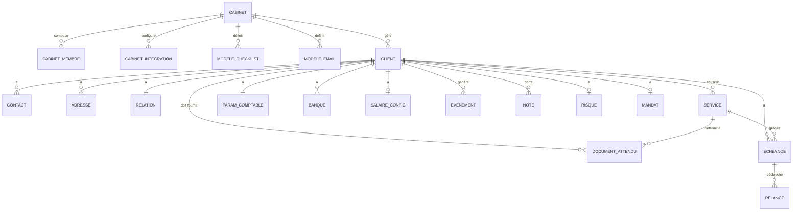

# Schéma de données — CRM

> Schéma Postgres / Supabase. Toutes les tables vivent dans le schéma `crm.*` sauf indication contraire.
> **Multi-tenant** : chaque table métier porte un `cabinet_id`. Voir [`/docs/architecture/multi-tenant.md`](../architecture/multi-tenant.md) et [`ADR 0005`](../architecture/decisions/0005-multi-tenant-natif-mvp.md).
> Conventions : `snake_case`, clés primaires `id uuid default gen_random_uuid()`, timestamps `created_at` / `updated_at` partout, soft delete via `archived_at timestamptz null`.

---

## 1. Vue d'ensemble — entités



---

## 2. Table racine multi-tenant : `crm.cabinet`

Le **tenant** de ZARYA. Une ligne = un cabinet fiduciaire client de ZARYA.

| Colonne | Type | Contrainte | Description |
|---|---|---|---|
| id | uuid | PK | UUID du tenant, propagé partout |
| raison_sociale | text | NOT NULL | Nom légal du cabinet |
| nom_court | text | | Affichage UI |
| ide | text | UNIQUE NULL | Numéro IDE suisse (CHE-...) |
| numero_tva | text | UNIQUE NULL | |
| forme_juridique | text | | SA, Sàrl, raison individuelle |
| langues_operationnelles | text[] | NOT NULL DEFAULT '{fr}' | `{fr}`, `{fr,de}`, etc. |
| langue_principale | enum | NOT NULL DEFAULT 'fr' | `fr`, `de`, `it`, `en` |
| fuseau_horaire | text | NOT NULL DEFAULT 'Europe/Zurich' | |
| devise_principale | text | NOT NULL DEFAULT 'CHF' | ISO 4217 |
| logo_url | text | | Chemin Supabase Storage |
| couleur_primaire | text | | Hex code pour branding (`#1A2B3C`) |
| couleur_secondaire | text | | |
| signature_email | text | | HTML, utilisé dans les emails de relance |
| plan_tarifaire | enum | NOT NULL DEFAULT 'starter' | `starter`, `pro`, `enterprise` |
| facturation_active_id | uuid | FK billing.subscription NULL | À créer plus tard |
| onboarding_termine | boolean | DEFAULT false | True quand le wizard d'onboarding fiduciaire est fini |
| onboarding_termine_at | timestamptz | | |
| statut | enum | NOT NULL DEFAULT 'actif' | `actif`, `suspendu`, `archive` |
| created_at | timestamptz | NOT NULL DEFAULT now | |
| created_by | uuid | FK auth.users | Premier responsable du cabinet |
| updated_at | timestamptz | NOT NULL DEFAULT now | |
| archived_at | timestamptz | | Soft delete |

**Pas de `cabinet_id` sur cette table** : elle est elle-même la racine du tenant.

**Index** : `(ide)`, `(statut)`, `(plan_tarifaire)`.

---

## 3. Table `crm.cabinet_membre`

Utilisateurs internes du cabinet (responsables, collaborateurs, gestionnaires).

| Colonne | Type | Contrainte | Description |
|---|---|---|---|
| id | uuid | PK | |
| cabinet_id | uuid | FK → cabinet NOT NULL | |
| auth_user_id | uuid | FK auth.users UNIQUE NOT NULL | Compte Supabase Auth |
| prenom | text | | |
| nom | text | NOT NULL | |
| email | text | NOT NULL | Email de connexion |
| telephone | text | | |
| role | enum | NOT NULL DEFAULT 'collaborateur' | `responsable`, `gestionnaire_salaires`, `collaborateur`, `lecteur` |
| permissions_specifiques | jsonb | | Overrides éventuels |
| specialisation | text[] | | Tags : "TVA", "Salaires", "PME", "Indépendants"... |
| photo_url | text | | |
| langue_interface | enum | DEFAULT 'fr' | |
| signature_email_personnelle | text | | Surcharge la signature cabinet si présente |
| actif | boolean | DEFAULT true | |
| derniere_connexion | timestamptz | | |
| created_at | timestamptz | | |
| archived_at | timestamptz | | |

**Index** : `(cabinet_id, actif)`, `(auth_user_id)`, `(email)`.

**Contrainte** : au moins un membre par cabinet avec `role = responsable`.

---

## 4. Tables de configuration cabinet

### 4.1 `crm.cabinet_integration`
Intégrations externes configurées par le cabinet.

| Colonne | Type | Contrainte | Description |
|---|---|---|---|
| id | uuid | PK | |
| cabinet_id | uuid | FK → cabinet NOT NULL | |
| type | enum | NOT NULL | `microsoft_365`, `nas`, `bexio_payroll`, `bexio_compta`, `cresus`, `winbiz`, `abacus`, `officemaker`, `autre` |
| nom_affichage | text | | "Mon Outlook pro" |
| credentials | jsonb | | Chiffrés (OAuth tokens, API keys) |
| parametres | jsonb | | Spécifiques au type |
| statut | enum | DEFAULT 'inactif' | `actif`, `inactif`, `erreur_auth`, `expire` |
| derniere_synchronisation | timestamptz | | |
| derniere_erreur | text | | |
| created_at | timestamptz | | |
| created_by | uuid | FK cabinet_membre | |

### 4.2 `crm.modele_checklist`
Modèles de checklists de documents attendus, **par cabinet** (avec override possible des templates ZARYA globaux).

| Colonne | Type | Contrainte | Description |
|---|---|---|---|
| id | uuid | PK | |
| cabinet_id | uuid | FK → cabinet NULL | Null = template ZARYA global, sinon override cabinet |
| nom | text | NOT NULL | "PME standard", "Indépendant TVA effective"... |
| type_client | enum | | `pme`, `independant`, `prive`, `association` |
| services_inclus | text[] | | |
| documents | jsonb | | Tableau de templates de `document_attendu` |
| herite_de_id | uuid | FK → modele_checklist | Si surcharge d'un autre modèle |
| actif | boolean | DEFAULT true | |
| created_at | timestamptz | | |

### 4.3 `crm.modele_email`
Modèles d'emails personnalisés par cabinet.

| Colonne | Type | Contrainte | Description |
|---|---|---|---|
| id | uuid | PK | |
| cabinet_id | uuid | FK → cabinet NULL | Null = template ZARYA global |
| nom | text | NOT NULL | |
| langue | enum | NOT NULL | |
| contexte | enum | NOT NULL | `relance_document`, `relance_echeance`, `validation_salaire`, `confirmation_validation`, `bienvenue_client` |
| sujet | text | NOT NULL | |
| corps | text | NOT NULL | Avec variables `{{client.nom}}`, `{{document.type}}`... |
| herite_de_id | uuid | FK → modele_email | |
| actif | boolean | DEFAULT true | |

**Pattern d'héritage** : voir [`/docs/architecture/multi-tenant.md` § 7.2](../architecture/multi-tenant.md).

---

## 5. Table `crm.client`

Les clients d'un cabinet (PME, indépendants, associations).

| Colonne | Type | Contrainte | Description |
|---|---|---|---|
| id | uuid | PK | |
| cabinet_id | uuid | FK → cabinet NOT NULL | **Tenant** |
| type | enum | NOT NULL | `pme`, `independant`, `prive`, `association` |
| raison_sociale | text | NOT NULL | |
| nom_court | text | | Alias UI + rattachement Doc |
| ide | text | NULL | Format CHE-XXX.XXX.XXX (unique au sein du cabinet, pas globalement) |
| numero_tva | text | NULL | |
| forme_juridique | text | | |
| langue | enum | NOT NULL DEFAULT 'fr' | |
| canal_prefere | enum | DEFAULT 'email' | `email`, `courrier`, `telephone`, `dashboard` |
| statut | enum | NOT NULL DEFAULT 'prospect' | `prospect`, `actif`, `inactif`, `archive` |
| responsable_id | uuid | FK → cabinet_membre | Collaborateur référent dans le cabinet |
| date_creation | date | NOT NULL DEFAULT today | |
| date_debut_relation | date | | |
| date_fin_relation | date | | |
| source_acquisition | text | | |
| tags | text[] | | |
| notes_commerciales | text | | |
| onboarding_session_id | uuid | FK onboarding_client.session UNIQUE | Lien vers la session d'onboarding |
| onboarding_termine | boolean | DEFAULT false | |
| created_at | timestamptz | NOT NULL DEFAULT now | |
| updated_at | timestamptz | NOT NULL DEFAULT now | |
| archived_at | timestamptz | | |

**Index** : `(cabinet_id, statut)`, `(cabinet_id, responsable_id)`, `(cabinet_id, ide)`, `(cabinet_id, raison_sociale)` (trigram).

**Contrainte** : `UNIQUE(cabinet_id, ide)` quand `ide IS NOT NULL` — un même IDE peut exister dans deux cabinets différents (un client commun à deux fiduciaires), mais une seule fois par cabinet.

---

## 6. Table `crm.contact`

| Colonne | Type | Contrainte | Description |
|---|---|---|---|
| id | uuid | PK | |
| cabinet_id | uuid | FK → cabinet NOT NULL | Dénormalisé pour RLS |
| client_id | uuid | FK → client NOT NULL | |
| prenom | text | | |
| nom | text | NOT NULL | |
| role | text | | "Dirigeant", "Comptable", "RH"... |
| est_principal | boolean | DEFAULT false | |
| est_contact_rh | boolean | DEFAULT false | |
| est_signataire | boolean | DEFAULT false | |
| email | text | | |
| telephone | text | | |
| langue | enum | | Hérite du client si null |
| notes | text | | |
| created_at | timestamptz | | |
| updated_at | timestamptz | | |
| archived_at | timestamptz | | |

**Trigger** : à l'INSERT/UPDATE, vérifier que `contact.cabinet_id = (SELECT cabinet_id FROM client WHERE id = contact.client_id)`.

**Contrainte** : au plus 1 contact `est_principal = true` par client.

---

## 7. Table `crm.adresse`

| Colonne | Type | Contrainte | Description |
|---|---|---|---|
| id | uuid | PK | |
| cabinet_id | uuid | FK → cabinet NOT NULL | |
| client_id | uuid | FK → client NOT NULL | |
| type | enum | NOT NULL | `postale`, `facturation`, `siege` |
| rue | text | | |
| complement | text | | |
| code_postal | text | | |
| ville | text | | |
| canton | text | | |
| pays | text | DEFAULT 'CH' | ISO 3166-1 alpha-2 |
| est_principale | boolean | DEFAULT false | |

---

## 8. Table `crm.relation`

1-1 avec client.

| Colonne | Type | Contrainte | Description |
|---|---|---|---|
| client_id | uuid | PK FK → client | |
| cabinet_id | uuid | FK → cabinet NOT NULL | |
| pack_tarifaire | text | | |
| honoraires_mensuels | numeric(10,2) | | CHF |
| honoraires_modele | enum | | `forfait`, `regie`, `mixte` |
| date_signature | date | | |
| date_renouvellement | date | | |
| duree_engagement_mois | integer | | |
| notes_facturation | text | | |
| iban_facturation | text | | |

---

## 9. Table `crm.mandat`

| Colonne | Type | Contrainte | Description |
|---|---|---|---|
| id | uuid | PK | |
| cabinet_id | uuid | FK → cabinet NOT NULL | |
| client_id | uuid | FK → client NOT NULL | |
| version | integer | DEFAULT 1 | |
| date_signature | date | NOT NULL | |
| date_effet | date | NOT NULL | |
| date_fin | date | | |
| document_id | uuid | FK doc.document | |
| services_couverts | text[] | | |
| signataires | jsonb | | |
| statut | enum | | `actif`, `expire`, `resilie` |

---

## 10. Table `crm.service`

| Colonne | Type | Contrainte | Description |
|---|---|---|---|
| id | uuid | PK | |
| cabinet_id | uuid | FK → cabinet NOT NULL | |
| client_id | uuid | FK → client NOT NULL | |
| type | enum | NOT NULL | `comptabilite`, `fiscalite`, `salaires`, `tva`, `bouclement`, `conseil` |
| actif | boolean | NOT NULL DEFAULT true | |
| date_activation | date | NOT NULL | |
| date_desactivation | date | | |
| frequence | enum | | `mensuelle`, `trimestrielle`, `semestrielle`, `annuelle`, `ponctuelle` |
| parametres | jsonb | | |
| notes | text | | |

**Contrainte** : `UNIQUE(client_id, type)` — un client a au plus une instance active de chaque service.

---

## 11. Table `crm.param_comptable`

| Colonne | Type | Contrainte | Description |
|---|---|---|---|
| client_id | uuid | PK FK → client | |
| cabinet_id | uuid | FK → cabinet NOT NULL | |
| logiciel | enum | | `bexio`, `abacus`, `cresus`, `winbiz`, `banana`, `excel`, `officemaker`, `autre` |
| logiciel_autre | text | | |
| plan_comptable | text | | |
| date_debut_exercice | date | | |
| date_bouclement | date | | |
| mode_transmission | enum | | `email`, `nas_partage`, `connecteur_logiciel`, `physique` |
| acces_logiciel_externe | jsonb | | Chiffré |
| derniere_synchronisation | timestamptz | | |

---

## 12. Table `crm.banque`

| Colonne | Type | Contrainte | Description |
|---|---|---|---|
| id | uuid | PK | |
| cabinet_id | uuid | FK → cabinet NOT NULL | |
| client_id | uuid | FK → client NOT NULL | |
| nom_banque | text | | |
| iban | text | NOT NULL | Chiffré au repos |
| bic | text | | |
| devise | text | DEFAULT 'CHF' | |
| usage | enum | | `principal`, `secondaire`, `paie`, `tva` |
| actif | boolean | DEFAULT true | |
| credentials_open_banking | jsonb | | Chiffré, pour intégration future |

---

## 13. Table `crm.document_attendu`

| Colonne | Type | Contrainte | Description |
|---|---|---|---|
| id | uuid | PK | |
| cabinet_id | uuid | FK → cabinet NOT NULL | |
| client_id | uuid | FK → client NOT NULL | |
| service_id | uuid | FK → service | |
| type_document | text | NOT NULL | |
| categorie | enum | | `bancaire`, `fiscal`, `salaire`, `commercial`, `administratif` |
| frequence | enum | NOT NULL | `mensuelle`, `trimestrielle`, `semestrielle`, `annuelle`, `ponctuelle` |
| obligatoire | boolean | DEFAULT true | |
| deadline_jours_apres_periode | integer | | |
| derniere_reception | date | | |
| derniere_periode_recue | text | | |
| statut_periode_courante | enum | | `recu`, `manquant`, `en_retard`, `non_applicable` |
| non_applicable_motif | text | | |
| actif | boolean | DEFAULT true | |

**Index** : `(cabinet_id, client_id, statut_periode_courante)`, `(derniere_reception)`.

---

## 14. Table `crm.salaire_config`

1-1 avec client, si service salaires actif.

| Colonne | Type | Contrainte | Description |
|---|---|---|---|
| client_id | uuid | PK FK → client | |
| cabinet_id | uuid | FK → cabinet NOT NULL | |
| nombre_employes | integer | | |
| frequence_paie | enum | DEFAULT 'mensuelle' | `mensuelle`, `quinzomadaire`, `hebdomadaire` |
| date_validation_jour_du_mois | integer | | 1-31 |
| contact_rh_id | uuid | FK → contact | |
| logiciel_paie | enum | | `bexio_payroll`, `cresus_salaires`, `winbiz_salaires`, `abacus_lohn`, `officemaker_staff`, `swissdec`, `autre`, `aucun` |
| caisse_avs | text | | |
| caisse_lpp | text | | |
| assurance_accidents | text | | |
| assurance_ijm | text | | |
| documents_attendus_par_periode | jsonb | | |
| envoi_automatique_relance | boolean | DEFAULT false | |
| derniere_validation_recue | date | | |

---

## 15. Table `crm.echeance`

| Colonne | Type | Contrainte | Description |
|---|---|---|---|
| id | uuid | PK | |
| cabinet_id | uuid | FK → cabinet NOT NULL | |
| client_id | uuid | FK → client NOT NULL | |
| service_id | uuid | FK → service NULL | |
| type | enum | NOT NULL | `fiscale`, `tva`, `bouclement`, `salaire`, `relance_documents`, `personnalisee` |
| libelle | text | NOT NULL | |
| date_echeance | date | NOT NULL | |
| date_alerte | date | | |
| statut | enum | NOT NULL DEFAULT 'a_venir' | `a_venir`, `imminente`, `en_retard`, `traitee`, `reportee`, `annulee` |
| date_traitement | date | | |
| reporte_a | date | | |
| motif_report | text | | |
| documents_requis | uuid[] | | |
| created_by | uuid | FK cabinet_membre | |

**Index** : `(cabinet_id, client_id, date_echeance)`, `(cabinet_id, statut, date_echeance)`.

---

## 16. Table `crm.relance`

| Colonne | Type | Contrainte | Description |
|---|---|---|---|
| id | uuid | PK | |
| cabinet_id | uuid | FK → cabinet NOT NULL | |
| client_id | uuid | FK → client NOT NULL | |
| echeance_id | uuid | FK → echeance NULL | |
| document_attendu_id | uuid | FK → document_attendu NULL | |
| canal | enum | DEFAULT 'email' | `email`, `telephone`, `sms` |
| destinataire_contact_id | uuid | FK → contact | |
| date_envoi | timestamptz | | |
| sujet | text | | |
| corps | text | | |
| statut | enum | | `brouillon`, `envoyee`, `lue`, `repondue`, `sans_reponse` |
| reponse_recue_le | timestamptz | | |
| validee_par | uuid | FK cabinet_membre | |
| numero_dans_serie | integer | | |

---

## 17. Table `crm.risque`

| Colonne | Type | Contrainte | Description |
|---|---|---|---|
| client_id | uuid | PK FK → client | |
| cabinet_id | uuid | FK → cabinet NOT NULL | |
| score | integer | NOT NULL DEFAULT 0 | 0-100 |
| niveau | enum | | `ok`, `surveillance`, `critique` |
| facteurs | jsonb | | |
| drapeau_critique | boolean | DEFAULT false | |
| drapeau_motif | text | | |
| derniere_activite | timestamptz | | |
| dernier_calcul | timestamptz | | |

---

## 18. Table `crm.evenement`

Journal append-only.

| Colonne | Type | Contrainte | Description |
|---|---|---|---|
| id | uuid | PK | |
| cabinet_id | uuid | FK → cabinet NOT NULL | |
| client_id | uuid | FK → client NULL | Null si événement cabinet-level (pas lié à un client) |
| type | enum | NOT NULL | `document_recu`, `document_classe`, `relance_envoyee`, `echeance_creee`, `service_active`, `note_ajoutee`, `mandat_signe`, `anomalie_facture`, `score_recalcule`, `cabinet_membre_ajoute`, `integration_configuree`... |
| acteur_type | enum | | `cabinet_membre`, `client_contact`, `systeme`, `ia` |
| acteur_id | uuid | | |
| ressource_type | text | | |
| ressource_id | uuid | | |
| description | text | | |
| metadata | jsonb | | |
| created_at | timestamptz | NOT NULL DEFAULT now | |

**Index** : `(cabinet_id, client_id, created_at DESC)`, `(cabinet_id, type)`. Partitionnement par mois après 6 mois.

---

## 19. Table `crm.note`

| Colonne | Type | Contrainte | Description |
|---|---|---|---|
| id | uuid | PK | |
| cabinet_id | uuid | FK → cabinet NOT NULL | |
| client_id | uuid | FK → client NOT NULL | |
| auteur_id | uuid | FK cabinet_membre | |
| contenu | text | NOT NULL | Markdown supporté |
| epingle | boolean | DEFAULT false | |
| visibilite | enum | DEFAULT 'cabinet' | `cabinet`, `responsable_seul` |
| created_at | timestamptz | | |
| updated_at | timestamptz | | |

---

## 20. Tables globales (sans `cabinet_id`)

### 20.1 `crm.standard_*`
Tables de référence partagées par tous les cabinets :
- `crm.standard_type_document` (types standards ZARYA)
- `crm.standard_categorie_document`
- `crm.standard_canton_ch`
- `crm.standard_caisse_avs`

Pas de `cabinet_id` car globales et en lecture seule pour les cabinets.

### 20.2 Override par cabinet
Si un cabinet veut ajouter un type custom, il crée une entrée dans `crm.cabinet_type_document` avec `cabinet_id`. La résolution applicative fusionne standards + custom.

---

## 21. Vues utiles

### `crm.v_client_dashboard`
Vue dénormalisée pour le listing (RLS scoped par `cabinet_id`).

```sql
CREATE VIEW crm.v_client_dashboard AS
SELECT
  c.id,
  c.cabinet_id,
  c.raison_sociale,
  c.type,
  c.statut,
  c.langue,
  r.score AS risque_score,
  r.niveau AS risque_niveau,
  (SELECT MIN(date_echeance) FROM crm.echeance e
   WHERE e.client_id = c.id AND e.statut IN ('a_venir', 'imminente')) AS prochaine_echeance,
  (SELECT COUNT(*) FROM crm.document_attendu d
   WHERE d.client_id = c.id AND d.statut_periode_courante = 'manquant') AS nb_documents_manquants,
  r.derniere_activite
FROM crm.client c
LEFT JOIN crm.risque r ON r.client_id = c.id
WHERE c.archived_at IS NULL;
```

### `crm.v_echeances_a_venir`
Échéances des 30 prochains jours, par cabinet.

### `crm.v_documents_manquants`
Documents en retard ou imminents, par cabinet.

---

## 22. Row Level Security

### 22.1 Activation
Toutes les tables `crm.*` (sauf `crm.cabinet` et `crm.standard_*`) ont RLS activée.

```sql
ALTER TABLE crm.client ENABLE ROW LEVEL SECURITY;
ALTER TABLE crm.contact ENABLE ROW LEVEL SECURITY;
ALTER TABLE crm.service ENABLE ROW LEVEL SECURITY;
-- etc. pour toutes les tables avec cabinet_id
```

### 22.2 Policies génériques
Pattern appliqué partout :

```sql
CREATE POLICY "tenant_isolation_select" ON crm.client
  FOR SELECT
  USING (cabinet_id = current_cabinet_id());

CREATE POLICY "tenant_isolation_insert" ON crm.client
  FOR INSERT
  WITH CHECK (cabinet_id = current_cabinet_id());

CREATE POLICY "tenant_isolation_update" ON crm.client
  FOR UPDATE
  USING (cabinet_id = current_cabinet_id())
  WITH CHECK (cabinet_id = current_cabinet_id());

CREATE POLICY "tenant_isolation_delete" ON crm.client
  FOR DELETE
  USING (cabinet_id = current_cabinet_id());
```

### 22.3 Cas spéciaux
- **`crm.cabinet`** : un user voit uniquement sa propre ligne (filtre par `id = current_cabinet_id()`)
- **`crm.cabinet_membre`** : voir les autres membres du même cabinet
- **Standards** (`crm.standard_*`) : RLS désactivée, lecture publique pour tous les rôles authentifiés

Voir [`/docs/architecture/multi-tenant.md` § 5](../architecture/multi-tenant.md).

---

## 23. Triggers critiques

### 23.1 Cohérence `cabinet_id`
À l'INSERT/UPDATE de toute table avec un FK vers `client`, vérifier que `cabinet_id = client.cabinet_id` :

```sql
CREATE OR REPLACE FUNCTION crm.check_cabinet_consistency()
RETURNS trigger AS $$
DECLARE
  v_client_cabinet_id uuid;
BEGIN
  SELECT cabinet_id INTO v_client_cabinet_id
  FROM crm.client WHERE id = NEW.client_id;
  
  IF NEW.cabinet_id <> v_client_cabinet_id THEN
    RAISE EXCEPTION 'cabinet_id incoherent: % vs % (client)', NEW.cabinet_id, v_client_cabinet_id;
  END IF;
  
  RETURN NEW;
END;
$$ LANGUAGE plpgsql;

CREATE TRIGGER trg_check_cabinet_contact
  BEFORE INSERT OR UPDATE ON crm.contact
  FOR EACH ROW EXECUTE FUNCTION crm.check_cabinet_consistency();
-- Idem pour toutes les tables avec client_id
```

### 23.2 Recalcul du risque
Trigger après INSERT/UPDATE sur `document_attendu`, `echeance`, `relance` → appelle `crm.recalc_risque(client_id)`.

### 23.3 Mise à jour `derniere_activite`
Trigger après INSERT sur `evenement` → met à jour `crm.risque.derniere_activite`.

### 23.4 Génération automatique des échéances récurrentes
Job nightly (`pg_cron`) : pour chaque `service` actif avec `frequence`, créer la prochaine échéance si elle n'existe pas. Calculer `statut_periode_courante` des `document_attendu`.

### 23.5 Provisioning d'un cabinet
À l'INSERT sur `crm.cabinet`, fonction qui crée :
- Le 1er membre (responsable)
- Les modèles par défaut hérités
- La configuration de base

Voir [`/docs/architecture/multi-tenant.md` § 7.1](../architecture/multi-tenant.md).

---

## 24. Volumétrie attendue

Pour ZARYA SaaS avec 100 cabinets actifs en année 2 :

| Table | Lignes estimées |
|---|---|
| cabinet | 100 |
| cabinet_membre | 500 (5 par cabinet en moyenne) |
| cabinet_integration | 400 |
| modele_checklist | ~1 000 (overrides + standards) |
| modele_email | ~2 000 |
| client | 5 000 (50 par cabinet) |
| contact | 15 000 |
| document_attendu | 60 000 |
| echeance | 240 000 |
| relance | 120 000 |
| evenement | 10 000 000+ |
| note | 200 000 |

**Conclusion** : Postgres tient confortablement. `evenement` mérite partitionnement par mois après 6-12 mois.

---

## 25. Migrations

```
crm/
├── 001_create_schema_crm.sql
├── 002_create_enums.sql
├── 003_create_cabinet.sql              ← table racine multi-tenant
├── 004_create_cabinet_membre.sql
├── 005_create_cabinet_integration.sql
├── 006_create_modeles.sql              ← modele_checklist, modele_email
├── 007_create_client.sql
├── 008_create_contact_adresse.sql
├── 009_create_relation_mandat.sql
├── 010_create_service_param_comptable.sql
├── 011_create_banque.sql
├── 012_create_document_attendu.sql
├── 013_create_salaire_config.sql
├── 014_create_echeance_relance.sql
├── 015_create_risque.sql
├── 016_create_evenement_note.sql
├── 017_create_standards.sql            ← tables globales sans cabinet_id
├── 018_create_views.sql
├── 019_create_functions.sql            ← current_cabinet_id, recalc_risque
├── 020_create_triggers.sql
├── 021_enable_rls.sql
├── 022_create_rls_policies.sql
├── 023_seed_standards.sql              ← données de référence (cantons, types...)
├── 024_seed_modeles_zarya.sql          ← templates ZARYA globaux par défaut
```

---

## 26. Évolution depuis le schéma initial

**Changement majeur acté en Sprint 2** :
- Ajout de la table racine `crm.cabinet`
- Ajout de la colonne `cabinet_id` sur toutes les tables métier (NOT NULL, FK vers cabinet)
- Ajout de la table `crm.cabinet_membre` (utilisateurs internes)
- Ajout de `crm.cabinet_integration`, `crm.modele_checklist`, `crm.modele_email`
- Pattern d'héritage des modèles (cabinet_id NULL = template ZARYA global)
- Triggers de cohérence `cabinet_id`
- RLS multi-tenant générique

Voir [`ADR 0005`](../architecture/decisions/0005-multi-tenant-natif-mvp.md).

---

## 27. À trancher avant implémentation

- [ ] **Chiffrement applicatif** IBAN / credentials_open_banking : Supabase Vault ou pgcrypto ?
- [ ] **Format JSONB `parametres`** : schéma JSON validé côté DB ou app ?
- [ ] **Champs personnalisables par cabinet** au-delà des templates : ajouter une table `crm.cabinet_custom_field` ou rester sur JSONB `metadata` ?
- [ ] **Suppression cabinet** : workflow détaillé (export + délai + hard delete)
- [ ] **Audit log dédié** : table `audit.crm_*` parallèle pour conformité fiscale ?
- [ ] **Versionnage du schéma** : table `crm.schema_version` pour migrations idempotentes ?
