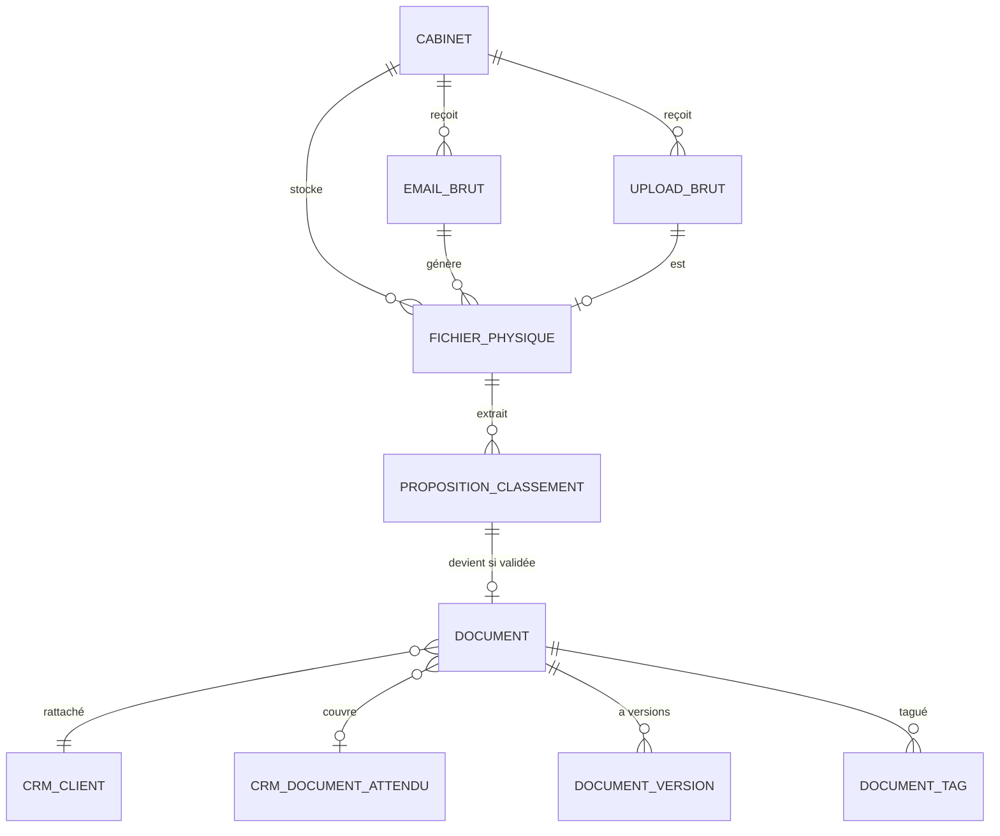

# Schéma de données — Document

> Schéma Postgres / Supabase. Toutes les tables vivent dans `doc.*`.
> Lien CRM : FK vers `crm.cabinet`, `crm.client`, `crm.document_attendu`.
> Pipeline IA : référence vers `extraction.invocation`.
>
> **Convention multi-tenant** : toutes les tables portent `cabinet_id uuid NOT NULL REFERENCES crm.cabinet(id) ON DELETE RESTRICT`, RLS génériques actives, trigger de cohérence avec `client_id`. Voir [`/docs/architecture/multi-tenant.md`](../architecture/multi-tenant.md).

---

## 1. Vue d'ensemble



> Convention `cabinet_id` implicite sur toutes les tables ci-dessous.

---

## 2. Enums

```sql
CREATE TYPE doc.source_ingestion AS ENUM (
  'email_microsoft',
  'email_autre',
  'nas',
  'upload_fiduciaire',
  'upload_client',
  'api',
  'import_manuel'
);

CREATE TYPE doc.statut_traitement AS ENUM (
  'recu',              -- ingestion brute terminée
  'en_classification', -- pipeline IA en cours
  'a_valider',         -- proposition en attente
  'valide',            -- classement validé
  'rejete',            -- rejeté (pas un document métier)
  'doublon',           -- détecté comme doublon, fusionné
  'erreur'             -- erreur pipeline
);

CREATE TYPE doc.categorie_document AS ENUM (
  'bancaire',
  'fiscal',
  'salaire',
  'commercial',
  'administratif',
  'autre'
);

CREATE TYPE doc.statut_classement AS ENUM (
  'auto',              -- classement automatique sans validation humaine
  'valide_humain',     -- validé par utilisateur
  'corrige_humain',    -- corrigé après proposition IA
  'manuel'             -- créé manuellement sans pipeline IA
);
```

---

## 3. Table `doc.email_brut`

Ingestion brute des emails reçus via Microsoft Graph (ou autres).

| Colonne | Type | Contrainte | Description |
|---|---|---|---|
| id | uuid | PK | |
| cabinet_id | uuid | FK → cabinet NOT NULL | |
| source | enum | NOT NULL DEFAULT 'email_microsoft' | |
| microsoft_message_id | text | UNIQUE NULL | ID Graph API |
| microsoft_internet_message_id | text | NULL | Header standard email |
| boite_source | text | | "Inbox", "factures@..." si boîte partagée |
| from_email | text | NOT NULL | |
| from_name | text | | |
| to_emails | text[] | | |
| cc_emails | text[] | | |
| subject | text | | |
| body_text | text | | Corps en plain text |
| body_html | text | | Corps HTML brut |
| date_envoi | timestamptz | | |
| date_reception | timestamptz | NOT NULL DEFAULT now | |
| has_attachments | boolean | NOT NULL DEFAULT false | |
| nb_attachments | integer | DEFAULT 0 | |
| taille_octets | bigint | | |
| statut | enum | NOT NULL DEFAULT 'recu' | |
| ignore_motif | text | | Si filtré (interne, newsletter, etc.) |
| created_at | timestamptz | NOT NULL DEFAULT now | |

**Index** : `(cabinet_id, date_reception DESC)`, `(microsoft_message_id)`, `(from_email)`, `(statut)`.

**Rétention** : 30 jours pour le `body_html` complet, ensuite purge (le contenu utile est extrait vers `fichier_physique` et `document`).

---

## 4. Table `doc.upload_brut`

Uploads manuels (drag & drop ZARYA, dashboard client).

| Colonne | Type | Contrainte | Description |
|---|---|---|---|
| id | uuid | PK | |
| cabinet_id | uuid | FK → cabinet NOT NULL | |
| source | enum | NOT NULL | `upload_fiduciaire` ou `upload_client` |
| uploaded_par | uuid | FK auth.users NOT NULL | |
| client_id | uuid | FK crm.client NULL | Pré-rattachement si connu (dashboard client) |
| nom_fichier_original | text | NOT NULL | |
| taille_octets | bigint | NOT NULL | |
| type_mime | text | NOT NULL | |
| hash_contenu | text | NOT NULL | SHA-256 |
| commentaire_uploader | text | | Note libre |
| statut | enum | NOT NULL DEFAULT 'recu' | |
| date_upload | timestamptz | NOT NULL DEFAULT now | |

**Index** : `(cabinet_id, date_upload DESC)`, `(hash_contenu)`, `(client_id)`.

---

## 5. Table `doc.fichier_physique`

Référence à un fichier réellement stocké (Supabase Storage ou NAS).

| Colonne | Type | Contrainte | Description |
|---|---|---|---|
| id | uuid | PK | |
| cabinet_id | uuid | FK → cabinet NOT NULL | |
| hash_contenu | text | NOT NULL | SHA-256 du contenu |
| taille_octets | bigint | NOT NULL | |
| type_mime | text | NOT NULL | |
| storage_provider | text | NOT NULL | 'supabase', 'nas', 'external' |
| storage_bucket | text | | Si Supabase |
| storage_path | text | NOT NULL | Chemin dans le bucket |
| chemin_nas | text | | Chemin original si source NAS |
| nas_integration_id | uuid | FK crm.cabinet_integration NULL | Si NAS |
| nas_mtime | timestamptz | | Pour détection modifications |
| nas_fichier_disparu | boolean | DEFAULT false | Si plus présent côté NAS |
| nb_pages | integer | | Pour PDFs |
| dimensions | text | | Pour images "1920x1080" |
| ocr_done | boolean | DEFAULT false | |
| ocr_text | text | | Texte extrait par OCR ou natif |
| ocr_invocation_id | uuid | FK extraction.invocation NULL | |
| email_brut_id | uuid | FK doc.email_brut NULL | Si pièce jointe d'un email |
| upload_brut_id | uuid | FK doc.upload_brut NULL | Si upload |
| source | enum | NOT NULL | |
| created_at | timestamptz | NOT NULL DEFAULT now | |

**Index** : `(cabinet_id, hash_contenu)` UNIQUE (déduplication), `(storage_provider, storage_path)`, `(nas_integration_id, nas_mtime)`.

**Contrainte** : `UNIQUE(cabinet_id, hash_contenu)` pour déduplication au sein d'un cabinet.

**Rationale** : un même fichier reçu par 3 canaux différents ne crée qu'une seule ligne. Les sources sont liées via `email_brut_id`, `upload_brut_id`, etc.

---

## 6. Table `doc.proposition_classement`

Propositions de classification par l'IA, en attente de validation.

| Colonne | Type | Contrainte | Description |
|---|---|---|---|
| id | uuid | PK | |
| cabinet_id | uuid | FK → cabinet NOT NULL | |
| fichier_physique_id | uuid | FK fichier_physique NOT NULL | |
| extraction_invocation_id | uuid | FK extraction.invocation NOT NULL | |
| email_brut_id | uuid | FK email_brut NULL | Si vient d'un email (contexte) |
| numero_dans_email | integer | | 1, 2, 3 pour PJs multiples |
| statut | enum | NOT NULL DEFAULT 'a_valider' | |
| --- Champs proposés --- | | | |
| type_propose | text | | "facture_fournisseur", "releve_bancaire"... |
| categorie_proposee | enum | | |
| client_id_propose | uuid | FK crm.client NULL | |
| document_attendu_id_propose | uuid | FK crm.document_attendu NULL | Si couvre une attente |
| periode_proposee | text | | "2026-04", "2026-Q1", "2025" |
| libelle_propose | text | | Libellé court extrait |
| fournisseur_propose | text | | Pour factures |
| montant_propose | numeric(14,2) | | |
| devise_proposee | text | | |
| date_document_proposee | date | | Date émission |
| confiance_globale | numeric(3,2) | | 0.00 à 1.00 |
| confiance_par_champ | jsonb | | Détail par champ |
| anomalies_detectees | text[] | | |
| doublons_potentiels | uuid[] | | FK vers doc.document existants |
| --- Validation --- | | | |
| valide_par | uuid | FK auth.users NULL | |
| date_validation | timestamptz | | |
| document_id | uuid | FK doc.document UNIQUE NULL | Si validée |
| rejet_motif | text | | Si rejet |
| corrections_apportees | jsonb | | Champs modifiés vs proposition initiale |
| created_at | timestamptz | NOT NULL DEFAULT now | |

**Index** : `(cabinet_id, statut, created_at)`, `(fichier_physique_id)`, `(client_id_propose)`, `(extraction_invocation_id)`.

---

## 7. Table `doc.document`

Document validé et classé. Source de vérité pour les autres modules.

| Colonne | Type | Contrainte | Description |
|---|---|---|---|
| id | uuid | PK | |
| cabinet_id | uuid | FK → cabinet NOT NULL | |
| client_id | uuid | FK crm.client NOT NULL | |
| fichier_physique_id | uuid | FK fichier_physique NOT NULL | |
| proposition_classement_id | uuid | FK proposition_classement UNIQUE NULL | |
| --- Classification --- | | | |
| type | text | NOT NULL | Slug standardisé |
| categorie | enum | NOT NULL | |
| document_attendu_id | uuid | FK crm.document_attendu NULL | Si couvre une attente |
| periode | text | | "2026-04" |
| date_document | date | | Date émission |
| date_reception | timestamptz | NOT NULL | Quand reçu par ZARYA |
| --- Identification --- | | | |
| libelle | text | NOT NULL | Pour affichage |
| nom_fichier_standardise | text | | Selon convention cabinet |
| reference_externe | text | | Numéro de facture, numéro de relevé, etc. |
| --- Statut --- | | | |
| statut_classement | enum | NOT NULL | `auto`, `valide_humain`, `corrige_humain`, `manuel` |
| confiance_classement | numeric(3,2) | | Confiance globale de l'IA (info historique) |
| --- Liens --- | | | |
| facture_id | uuid | FK facture.facture NULL | Si déclenchement pipeline Facture |
| salaire_periode_id | uuid | FK salaire.periode NULL | |
| --- Audit --- | | | |
| cree_par | uuid | FK auth.users NULL | Null si auto |
| created_at | timestamptz | NOT NULL DEFAULT now | |
| updated_at | timestamptz | NOT NULL DEFAULT now | |
| archived_at | timestamptz | | Soft delete |

**Index** : 
- `(cabinet_id, client_id, periode DESC)`
- `(cabinet_id, type, periode)`
- `(cabinet_id, statut_classement)`
- `(document_attendu_id)`
- `(facture_id)`
- `(date_reception DESC)`
- GIN sur `to_tsvector(libelle)` pour recherche full-text

---

## 8. Table `doc.document_version`

Versionnage simple : si un document est modifié côté NAS et re-ingéré.

| Colonne | Type | Contrainte | Description |
|---|---|---|---|
| id | uuid | PK | |
| cabinet_id | uuid | FK → cabinet NOT NULL | |
| document_id | uuid | FK doc.document NOT NULL | |
| version | integer | NOT NULL | 1, 2, 3... |
| fichier_physique_id | uuid | FK fichier_physique NOT NULL | |
| changement_motif | text | | "modifié côté NAS", "remplacement upload" |
| created_at | timestamptz | NOT NULL DEFAULT now | |
| created_by | uuid | FK auth.users NULL | |

**Index** : `(document_id, version DESC)`.

**Contrainte** : `UNIQUE(document_id, version)`.

**Rationale** : pas un système de version Git, juste un audit minimal. Les versions précédentes restent accessibles mais le `document.fichier_physique_id` pointe toujours sur la version courante.

---

## 9. Table `doc.document_tag`

Tags libres applicables à un document. Permet de retrouver/filtrer.

| Colonne | Type | Contrainte | Description |
|---|---|---|---|
| document_id | uuid | FK doc.document NOT NULL | |
| cabinet_id | uuid | FK → cabinet NOT NULL | |
| tag | text | NOT NULL | |
| ajoute_par | uuid | FK auth.users | |
| ajoute_at | timestamptz | NOT NULL DEFAULT now | |

**PK composite** : `(document_id, tag)`.

**Index** : `(cabinet_id, tag)` pour filtres rapides.

---

## 10. Table `doc.cabinet_type_document`

Types de documents custom par cabinet (override des standards ZARYA).

| Colonne | Type | Contrainte | Description |
|---|---|---|---|
| id | uuid | PK | |
| cabinet_id | uuid | FK → cabinet NULL | NULL = template ZARYA global |
| slug | text | NOT NULL | "facture_fournisseur", "releve_bancaire_ubs"... |
| nom_affichage_fr | text | NOT NULL | |
| nom_affichage_de | text | | |
| nom_affichage_it | text | | |
| categorie | enum | NOT NULL | |
| description | text | | Pour l'IA |
| actif | boolean | NOT NULL DEFAULT true | |
| ordre | integer | DEFAULT 0 | |

**Contrainte** : `UNIQUE(cabinet_id, slug)` (gère le NULL de cabinet_id correctement).

**Pattern d'héritage** : voir [`/docs/architecture/multi-tenant.md` § 7.2](../architecture/multi-tenant.md).

---

## 11. Table `doc.cabinet_convention_nommage`

Convention de nommage des fichiers par cabinet.

| Colonne | Type | Contrainte | Description |
|---|---|---|---|
| cabinet_id | uuid | PK FK → cabinet | |
| template_nom_fichier | text | NOT NULL | "{annee}-{mois}_{type}_{client_nom_court}" |
| template_chemin_nas | text | | Pour rangement NAS (Phase 2 pattern B) |
| separateur | text | DEFAULT '_' | |
| casse | text | DEFAULT 'snake_case' | `snake_case`, `kebab-case`, `original` |
| extension_lowercase | boolean | DEFAULT true | |
| caracteres_interdits | text[] | | À remplacer dans les noms |

---

## 12. Table `doc.regle_auto_classement`

Règles d'auto-classement apprises (Phase 2) ou définies manuellement.

| Colonne | Type | Contrainte | Description |
|---|---|---|---|
| id | uuid | PK | |
| cabinet_id | uuid | FK → cabinet NOT NULL | |
| nom | text | NOT NULL | "Relevés UBS de Dupont SA en auto" |
| pattern_match | jsonb | NOT NULL | Conditions (expéditeur, type, client...) |
| action | jsonb | NOT NULL | Classification à appliquer |
| confiance_minimale | numeric(3,2) | DEFAULT 0.85 | |
| nb_applications | integer | DEFAULT 0 | Stats d'usage |
| nb_corrections_apres | integer | DEFAULT 0 | Signal de qualité |
| actif | boolean | DEFAULT true | |
| created_at | timestamptz | | |
| created_by | uuid | FK auth.users | |

**Rationale** : permet à un cabinet d'automatiser totalement certains patterns récurrents (les relevés bancaires du fournisseur X pour le client Y passent toujours en auto).

---

## 13. Vues

### `doc.v_inbox_a_valider`
Inbox principale pour Julie : toutes les propositions en attente.

```sql
CREATE VIEW doc.v_inbox_a_valider AS
SELECT
  p.id AS proposition_id,
  p.cabinet_id,
  p.fichier_physique_id,
  p.client_id_propose,
  c.raison_sociale AS client_nom,
  p.type_propose,
  p.categorie_proposee,
  p.periode_proposee,
  p.libelle_propose,
  p.confiance_globale,
  array_length(p.anomalies_detectees, 1) AS nb_anomalies,
  fp.nom_fichier_original,
  fp.type_mime,
  e.from_email,
  e.subject AS email_subject,
  COALESCE(e.date_reception, fp.created_at) AS date_reception,
  p.created_at
FROM doc.proposition_classement p
JOIN doc.fichier_physique fp ON fp.id = p.fichier_physique_id
LEFT JOIN doc.email_brut e ON e.id = p.email_brut_id
LEFT JOIN crm.client c ON c.id = p.client_id_propose
WHERE p.statut = 'a_valider'
ORDER BY p.confiance_globale DESC, p.created_at DESC;
```

### `doc.v_documents_par_client`
Documents validés groupés par client, pour navigation.

### `doc.v_documents_par_attendu`
Croisement avec `crm.document_attendu` pour voir les attentes couvertes.

---

## 14. Triggers et fonctions

### 14.1 Déduplication à l'ingestion
À l'INSERT sur `doc.fichier_physique` : vérifier `hash_contenu` existant dans le cabinet. Si match → ne pas créer nouveau, lier la source (email_brut, upload_brut) à l'existant.

### 14.2 Cohérence cabinet/client
Trigger sur INSERT/UPDATE des tables avec `client_id` : vérifier que `cabinet_id = (SELECT cabinet_id FROM crm.client WHERE id = NEW.client_id)`.

### 14.3 Effets de bord sur validation
Trigger sur `proposition_classement` UPDATE quand `statut` passe à `valide` :
1. Créer `doc.document` final
2. Mettre à jour `crm.document_attendu.statut_periode_courante` si rattachement
3. Créer `crm.evenement` (type `document_recu`)
4. Recalcul `crm.risque` du client
5. Si type = facture → trigger pipeline Facture
6. Si type lié à salaire → notification module Salaire
7. Indexation Search (async)

### 14.4 Nettoyage email_brut
Job nightly : purger `body_html` des emails de plus de 30 jours pour économiser de l'espace.

### 14.5 Détection NAS disparu
Job du scan NAS : si fichier précédemment indexé est absent du listing → `fichier_physique.nas_fichier_disparu = true` + notification cabinet.

---

## 15. RLS

Pattern standard multi-tenant sur toutes les tables (4 policies génériques `tenant_isolation_*` via `current_cabinet_id()`).

**Cas spécial dashboard client** : le contact RH client voit uniquement les documents qu'il a uploadés OU les documents non sensibles de son `client_id` :

```sql
CREATE POLICY "client_contact_voit_ses_uploads" ON doc.document
  FOR SELECT
  USING (
    cabinet_id = current_cabinet_id()  -- cas standard fiduciaire
    OR
    (
      client_id IN (
        SELECT client_id FROM salaire.acces_client
        WHERE auth_user_id = auth.uid() AND actif = true
      )
      AND cree_par = auth.uid()  -- uniquement ses propres uploads
    )
  );
```

---

## 16. Volumétrie attendue

Pour ZARYA avec 100 cabinets, 50-200 clients chacun, à 2 ans :

| Table | Lignes estimées |
|---|---|
| email_brut | 5M (intensif) |
| upload_brut | 500K |
| fichier_physique | 5M (déduplication aide) |
| proposition_classement | 5M |
| document | 4M (rejet, doublons soustraits) |
| document_version | 100K |
| document_tag | 2M |
| cabinet_type_document | ~1000 |
| regle_auto_classement | ~500 |

**Partitionnement** : `email_brut`, `fichier_physique`, `proposition_classement`, `document` par mois après 6-12 mois.

**Stockage** : ~1-2 TB par cabinet de croisière en Supabase Storage.

---

## 17. Migrations

```
doc/
├── 030_create_schema_doc.sql
├── 031_create_enums_doc.sql
├── 032_create_email_brut.sql
├── 033_create_upload_brut.sql
├── 034_create_fichier_physique.sql
├── 035_create_proposition_classement.sql
├── 036_create_document.sql
├── 037_create_document_version.sql
├── 038_create_document_tag.sql
├── 039_create_cabinet_type_document.sql
├── 040_create_cabinet_convention_nommage.sql
├── 041_create_regle_auto_classement.sql
├── 042_create_views_doc.sql
├── 043_create_functions_doc.sql
├── 044_create_triggers_doc.sql
├── 045_enable_rls_doc.sql
├── 046_create_rls_policies_doc.sql
├── 047_seed_standards_doc.sql            -- types ZARYA par défaut
```

---

## 18. À trancher avant implémentation

- [ ] **Stockage du body_html** : 30 jours suffit ? Ou conservation longue pour audit ?
- [ ] **Hash de contenu** : SHA-256 OK ou besoin de blake3 (plus rapide) ?
- [ ] **document_tag** : table dédiée ou jsonb dans `document.metadata` ?
- [ ] **Versioning** : conservation des versions précédentes côté Storage ?
- [ ] **Stratégie de purge** des `proposition_classement` rejetées (rétention vs économie d'espace)
- [ ] **Index full-text** : pg_trgm ou tsvector ou les deux ?
- [ ] **Format `pattern_match` jsonb** : schéma JSON validé côté DB ou app ?
- [ ] **Réutilisation hash entre cabinets** : un même PDF reçu par 2 cabinets différents = 2 fichiers physiques distincts (privacy) ou partagé (économie) ? **Décision proposée : distincts (privacy)**
