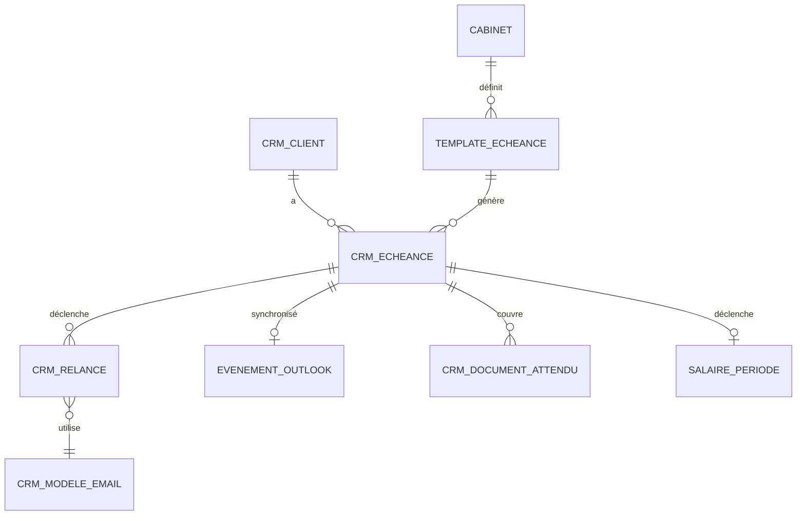

# Schéma de données — Échéances et relances

> Schéma Postgres / Supabase. Tables principales dans `crm.*` (déjà esquissées dans `crm-schema.md`) + extensions dans `calendar.*` pour les templates et la sync Outlook.
> **Convention multi-tenant** : `cabinet_id` implicite partout. Voir [`/docs/architecture/multi-tenant.md`](../architecture/multi-tenant.md).
>
> **Note** : ce document **complète** `crm-schema.md` (qui décrit déjà `crm.echeance` et `crm.relance` minimalement). Il ajoute les détails et les nouvelles tables `calendar.*`.

---

## 1. Vue d'ensemble



> `cabinet_id` implicite sur toutes les tables.

---

## 2. Enums (extensions)

Les enums de base sont dans `crm-schema.md`. Voici ceux spécifiques au domaine échéance/calendrier :

```sql
CREATE TYPE calendar.frequence_echeance AS ENUM (
  'mensuelle',
  'trimestrielle',
  'semestrielle',
  'annuelle',
  'ponctuelle',
  'evenement'             -- événement isolé, pas récurrent
);

CREATE TYPE calendar.politique_relance AS ENUM (
  'validation_humaine_systematique',  -- Mode A
  'auto_premiere_relance',            -- Mode B
  'auto_complete'                     -- Mode C
);

CREATE TYPE calendar.canal_relance AS ENUM (
  'email',
  'telephone',           -- log uniquement, action manuelle
  'sms',                 -- Phase 2
  'dashboard'            -- notification dans le dashboard client
);

CREATE TYPE calendar.outlook_sync_statut AS ENUM (
  'a_synchroniser',
  'synchronise',
  'erreur_sync',
  'desactive'
);
```

---

## 3. Table `calendar.template_echeance`

Templates récurrents pour génération automatique des échéances. Hérite du pattern templates ZARYA (cabinet_id NULL = global).

| Colonne | Type | Contrainte | Description |
|---|---|---|---|
| id | uuid | PK | |
| cabinet_id | uuid | FK → cabinet NULL | NULL = template ZARYA global |
| nom | text | NOT NULL | "Validation salaire mensuel", "TVA trimestrielle"... |
| type_echeance | text | NOT NULL | Aligné avec `crm.echeance.type` |
| frequence | enum | NOT NULL | |
| --- Critères d'application --- | | | |
| service_requis | text[] | | Services qui activent ce template |
| canton_specifique | text[] | | Cantons concernés si applicable |
| regime_tva | text[] | | "effective_trimestre", "effective_semestre"... |
| --- Génération --- | | | |
| jour_du_mois | integer | | Pour mensuelles (1-31) |
| mois_dans_annee | integer[] | | Pour trimestrielles, annuelles |
| date_specifique | date | | Pour ponctuelles cantonales |
| delai_alerte_jours | integer | NOT NULL DEFAULT 7 | J-X avant échéance |
| --- Modèle relances --- | | | |
| modele_email_id_relance_1 | uuid | FK crm.modele_email | |
| modele_email_id_relance_2 | uuid | FK crm.modele_email | |
| modele_email_id_relance_3 | uuid | FK crm.modele_email | |
| jours_entre_relances | integer | DEFAULT 3 | |
| max_relances_auto | integer | DEFAULT 3 | Avant escalade |
| --- Documents requis --- | | | |
| documents_requis_types | text[] | | Slugs de types de documents |
| --- Métadonnées --- | | | |
| herite_de_id | uuid | FK template_echeance NULL | Si override |
| description | text | | |
| actif | boolean | DEFAULT true | |
| created_at | timestamptz | | |
| created_by | uuid | FK auth.users | |

**Index** : `(cabinet_id, type_echeance, actif)`, `(herite_de_id)`.

**Templates standard ZARYA** (cabinet_id NULL) :
- Validation salaire mensuel
- TVA trimestrielle (effective)
- TVA semestrielle
- Déclaration impôt entreprise (par canton)
- Bouclement annuel
- Relances mensuelles relevés bancaires

---

## 4. Table `crm.echeance` (extension de crm-schema.md)

Cette table est définie dans `crm-schema.md`. Ajout de colonnes pour la sync Outlook et le tracking détaillé :

| Colonne ajoutée | Type | Contrainte | Description |
|---|---|---|---|
| template_id | uuid | FK calendar.template_echeance NULL | Si générée depuis template |
| document_attendu_ids | uuid[] | | Documents qui couvrent cette échéance |
| escalade_au | uuid | FK crm.cabinet_membre | Si escalade humaine demandée |
| escalade_at | timestamptz | | |
| outlook_event_id | text | | ID Microsoft Graph |
| outlook_sync_statut | enum | DEFAULT 'a_synchroniser' | |
| outlook_last_sync | timestamptz | | |
| outlook_etag | text | | Pour détection conflits |
| pause_jusquau | date | | Pause manuelle ou suite à réponse client |
| pause_motif | text | | |

Voir [`crm-schema.md` § 15](./crm-schema.md) pour les colonnes de base.

---

## 5. Table `crm.relance` (extension de crm-schema.md)

Ajouts pour tracking détaillé :

| Colonne ajoutée | Type | Contrainte | Description |
|---|---|---|---|
| modele_email_utilise_id | uuid | FK crm.modele_email NULL | |
| corps_genere_brut | text | | Avant interpolation |
| variables_interpolees | jsonb | | Snapshot des variables utilisées |
| ton_applique | text | | "formel", "cordial", "insistant" (Phase 2) |
| --- Pipeline d'envoi --- | | | |
| brouillon_valide_par | uuid | FK auth.users | Si politique = validation humaine |
| brouillon_valide_at | timestamptz | | |
| microsoft_message_id | text | | ID du message envoyé via Graph |
| --- Tracking destinataire --- | | | |
| email_lu_at | timestamptz | | Si MS Graph remonte read receipt |
| reponse_recue_email_brut_id | uuid | FK doc.email_brut | Si réponse reçue par email |
| --- Mode --- | | | |
| envoi_automatique | boolean | NOT NULL DEFAULT false | True si auto-envoi |
| pause_recommandee_par_systeme | boolean | DEFAULT false | Suite à signal "client a répondu récemment" |

---

## 6. Table `calendar.evenement_outlook`

Tracking de la synchronisation Outlook (pour éviter de polluer `crm.echeance`).

| Colonne | Type | Contrainte | Description |
|---|---|---|---|
| id | uuid | PK | |
| cabinet_id | uuid | FK → cabinet NOT NULL | |
| echeance_id | uuid | FK crm.echeance NOT NULL | |
| --- Microsoft Graph --- | | | |
| outlook_event_id | text | NOT NULL | |
| outlook_calendar_id | text | NOT NULL | Calendrier cible (du responsable, ou partagé cabinet) |
| outlook_etag | text | | |
| outlook_recurrence_id | text | | Pour événements récurrents |
| --- État sync --- | | | |
| derniere_modification_zarya | timestamptz | NOT NULL | Pour résolution conflit |
| derniere_modification_outlook | timestamptz | | Reçue via webhook |
| sync_direction | text | | `vers_outlook`, `depuis_outlook` |
| conflit_detecte | boolean | DEFAULT false | |
| conflit_resolution | text | | "manual_required", "zarya_wins", "outlook_wins" |
| --- Audit --- | | | |
| created_at | timestamptz | NOT NULL DEFAULT now | |
| updated_at | timestamptz | NOT NULL DEFAULT now | |

**Index** : `(echeance_id)` UNIQUE, `(outlook_event_id)`, `(conflit_detecte)`.

---

## 7. Table `calendar.cabinet_config`

Configuration calendrier par cabinet.

| Colonne | Type | Contrainte | Description |
|---|---|---|---|
| cabinet_id | uuid | PK FK → cabinet | |
| politique_relance_defaut | enum | NOT NULL DEFAULT 'validation_humaine_systematique' | |
| politique_relance_par_type | jsonb | | Override par type d'échéance |
| --- Délais --- | | | |
| delai_alerte_defaut_jours | integer | DEFAULT 7 | |
| delais_par_type | jsonb | | Override par type |
| --- Comportements --- | | | |
| pause_apres_reponse_jours | integer | DEFAULT 2 | Pas de relance si client a répondu dans X jours |
| pause_si_reunion_jours | integer | DEFAULT 7 | Pas de relance si réunion dans X jours |
| max_relances_avant_escalade | integer | DEFAULT 3 | |
| --- Outlook sync --- | | | |
| sync_outlook_active | boolean | DEFAULT true | |
| outlook_calendar_id_cible | text | | Calendar partagé ou par responsable |
| outlook_sync_mode | text | DEFAULT 'par_responsable' | `par_responsable`, `calendrier_partage` |
| --- Périodes de fermeture cabinet --- | | | |
| fermetures_annuelles | jsonb | | [{"start": "2026-07-20", "end": "2026-08-05"}] |
| --- Métadonnées --- | | | |
| updated_at | timestamptz | | |

---

## 8. Table `calendar.pause_client`

Demande de pause des relances par le contact RH client (via dashboard client).

| Colonne | Type | Contrainte | Description |
|---|---|---|---|
| id | uuid | PK | |
| cabinet_id | uuid | FK → cabinet NOT NULL | |
| client_id | uuid | FK crm.client NOT NULL | |
| demande_par | uuid | FK auth.users NOT NULL | Le contact RH |
| date_debut | date | NOT NULL | |
| date_fin | date | NOT NULL | |
| motif | text | | "Vacances été", "Surcharge ponctuelle" |
| types_echeances_paused | text[] | | NULL = toutes |
| --- Statut --- | | | |
| actif | boolean | NOT NULL DEFAULT true | |
| created_at | timestamptz | | |

**Index** : `(cabinet_id, client_id, date_debut, date_fin)`.

**Effet** : les jobs de génération de relances vérifient les pauses actives avant d'envoyer.

---

## 9. Table `crm.modele_email` (rappel)

Définie dans `crm-schema.md`, juste rappelée ici pour cohérence : c'est la source des templates de relance, avec héritage cabinet/global.

Pour les **contextes** de modèle email pertinents au module Calendar :
- `relance_document` : relance sur document manquant
- `relance_echeance` : relance sur échéance imminente
- `validation_salaire` : notification client de validation à faire
- `confirmation_validation` : ack de validation reçue
- `confirmation_traitement` : ack quand échéance traitée

---

## 10. Vues

### `calendar.v_echeances_a_traiter`
Vue principale pour la sidebar Calendar (par jour, par responsable).

```sql
CREATE VIEW calendar.v_echeances_a_traiter AS
SELECT
  e.id,
  e.cabinet_id,
  e.client_id,
  c.raison_sociale AS client_nom,
  e.type,
  e.libelle,
  e.date_echeance,
  e.date_alerte,
  e.statut,
  e.responsable_id,
  m.prenom || ' ' || m.nom AS responsable_nom,
  (SELECT COUNT(*) FROM crm.document_attendu d 
   WHERE d.id = ANY(e.document_attendu_ids) AND d.statut_periode_courante = 'manquant') AS nb_docs_manquants,
  (SELECT COUNT(*) FROM crm.relance r WHERE r.echeance_id = e.id) AS nb_relances_envoyees
FROM crm.echeance e
JOIN crm.client c ON c.id = e.client_id
LEFT JOIN crm.cabinet_membre m ON m.id = e.responsable_id
WHERE e.statut IN ('a_venir', 'imminente', 'en_retard')
  AND e.date_echeance <= now() + interval '30 days'
ORDER BY e.date_echeance ASC, e.statut DESC;
```

### `calendar.v_relances_a_valider`
File de validation pour Marc/Julie.

### `calendar.v_calendrier_mois`
Vue agrégée par jour pour le calendrier visuel.

### `calendar.v_clients_en_retard`
Clients avec au moins une échéance `en_retard`. Pour le dashboard responsable.

---

## 11. Triggers et fonctions

### 11.1 Génération automatique des échéances récurrentes
Job pg_cron quotidien :

```sql
CREATE OR REPLACE FUNCTION calendar.generer_echeances_futures()
RETURNS void AS $$
DECLARE
  v_template record;
  v_client record;
BEGIN
  -- Pour chaque template actif, pour chaque client avec le service correspondant
  FOR v_template IN SELECT * FROM calendar.template_echeance WHERE actif = true
  LOOP
    FOR v_client IN 
      SELECT DISTINCT c.id, c.cabinet_id
      FROM crm.client c
      JOIN crm.service s ON s.client_id = c.id
      WHERE s.type = ANY(v_template.service_requis)
        AND s.actif = true
        AND c.archived_at IS NULL
    LOOP
      -- Calculer les prochaines occurrences sur 3 mois glissants
      -- Insérer si pas déjà existantes
      -- ...
    END LOOP;
  END LOOP;
END;
$$ LANGUAGE plpgsql;

-- Exécuter chaque nuit
SELECT cron.schedule('generer_echeances', '0 2 * * *', 
  'SELECT calendar.generer_echeances_futures();');
```

### 11.2 Transition de statut automatique
Job horaire :
- `a_venir` → `imminente` quand `date_alerte` atteinte
- `imminente` → `en_retard` quand `date_echeance` dépassée

### 11.3 Génération de brouillons de relance
Quand une échéance passe `imminente` ou a des documents manquants :
- Sélection du template d'email approprié
- Interpolation des variables
- Création d'une `crm.relance` en statut `brouillon`
- Selon `politique_relance` : envoi auto OU mise en file de validation

### 11.4 Pause intelligente
Avant chaque création de relance, vérifier :
- Le client a-t-il répondu dans les `pause_apres_reponse_jours` ?
- Réunion planifiée dans `pause_si_reunion_jours` ?
- Pause manuelle active (`calendar.pause_client`) ?
- Cabinet en fermeture annuelle ?

Si oui → reporter la relance.

### 11.5 Sync Outlook
Job toutes les 5 minutes :
- Échéances avec `outlook_sync_statut = 'a_synchroniser'` → push vers Outlook
- Mise à jour `outlook_event_id` et `outlook_etag`

Webhook Outlook entrant :
- Update reçu → réception via endpoint `/api/integrations/microsoft/webhook/calendar`
- Comparaison avec `outlook_last_sync` pour détecter changements
- Application des modifications dans `crm.echeance`

### 11.6 Escalade
Quand `relance_count >= max_relances_avant_escalade` et toujours pas de réponse :
- Plus de relance auto
- Notification au `responsable` du client
- Création d'une entrée `crm.evenement` (type `echeance_escaladee`)

---

## 12. RLS

Pattern standard multi-tenant sur toutes les tables.

**Cas client final** : le contact RH client voit ses propres échéances via vue filtrée :

```sql
CREATE POLICY "client_contact_voit_ses_echeances" ON crm.echeance
  FOR SELECT
  USING (
    cabinet_id = current_cabinet_id()  -- standard
    OR
    client_id IN (
      SELECT client_id FROM salaire.acces_client
      WHERE auth_user_id = auth.uid() AND actif = true
    )
  );
```

**Création de pause par client** : RLS spécifique pour permettre INSERT sur `calendar.pause_client` par le contact RH du client uniquement.

---

## 13. Volumétrie attendue

Pour 100 cabinets, 100 clients/cabinet, ~10 échéances/client/an :

| Table | Lignes estimées |
|---|---|
| template_echeance | ~500 (overrides) + ~50 (standards ZARYA) |
| crm.echeance | 200 000 (10 × 100 × 100 × 2 ans) |
| crm.relance | 300 000 (1.5 relance moyenne par échéance) |
| evenement_outlook | 200 000 |
| cabinet_config | 100 |
| pause_client | ~5000 (5% des clients en pause une fois par an) |

**Partitionnement** : `crm.echeance` et `crm.relance` par année après 2 ans.

---

## 14. Migrations

```
calendar/
├── 100_create_schema_calendar.sql
├── 101_create_enums_calendar.sql
├── 102_alter_crm_echeance.sql           -- Ajout colonnes Outlook
├── 103_alter_crm_relance.sql            -- Ajout colonnes tracking
├── 104_create_template_echeance.sql
├── 105_create_evenement_outlook.sql
├── 106_create_cabinet_config.sql
├── 107_create_pause_client.sql
├── 108_create_views_calendar.sql
├── 109_create_functions_calendar.sql
├── 110_create_triggers_calendar.sql
├── 111_enable_rls_calendar.sql
├── 112_create_rls_policies_calendar.sql
├── 113_seed_templates_zarya.sql         -- Templates standards
```

---

## 15. À trancher avant implémentation

- [ ] **Granularité du job de génération** : quotidien, horaire, ou trigger événementiel ?
- [ ] **Outlook : calendrier individuel vs partagé** : politique par défaut cabinet ?
- [ ] **Détection conflit Outlook** : si modif côté Outlook ET côté ZARYA, qui gagne par défaut ?
- [ ] **Format des templates** : Handlebars (`{{var}}`) ou Liquid ou DIY ?
- [ ] **Échéances cantonales** : base de données à maintenir où ? (interne ou source externe)
- [ ] **Auto-détection des régimes TVA** : depuis Bexio ou saisie manuelle ?
- [ ] **Calendrier partagé cabinet** : un seul ou un par équipe ?
- [ ] **Pauses client** : peut-on les faire approuver par le cabinet avant application ?
- [ ] **Politique de purge** des relances anciennes (rétention vs volume) ?
- [ ] **Sync calendrier client** : si le contact RH a Outlook, on sync chez lui aussi ?
