# ERD global ZARYA

> Vue d'ensemble de **toutes les relations entre tables** de ZARYA. Ce document est une **carte mentale** pour comprendre l'architecture des données, pas une référence exhaustive (voir les schémas dédiés pour le détail).
>
> **Source de vérité** : les schémas individuels (`crm-schema.md`, `document-schema.md`, etc.). Ce document est un **dérivé** synthétique.

---

## 1. Schémas Postgres utilisés

| Schéma | Rôle | Doc dédiée |
|---|---|---|
| `crm.*` | Centre de vérité : cabinets, clients, contacts, échéances | [crm-schema.md](./crm-schema.md) |
| `salaire.*` | Employés, périodes paie, propositions, accès client | [salaire-schema.md](./salaire-schema.md), [onboarding-client-schema.md](./onboarding-client-schema.md) |
| `doc.*` | Documents, propositions de classement, fichiers physiques | [document-schema.md](./document-schema.md) |
| `facture.*` | Factures fournisseurs, propositions, fournisseurs, exports | [facture-schema.md](./facture-schema.md) |
| `calendar.*` | Templates échéances, sync Outlook, pause client | [echeance-schema.md](./echeance-schema.md) |
| `extraction.*` | Invocations LLM (audit générique) | [extraction-ia.md](../modules/extraction-ia.md) |
| `audit.*` | Logs append-only sensibles | [security-and-audit.md](../architecture/security-and-audit.md) |
| `auth.*` | Géré par Supabase Auth | — |
| `storage.*` | Géré par Supabase Storage | — |

---

## 2. Vue d'ensemble macro

```mermaid
graph TB
    subgraph "Tenant root"
        CABINET[crm.cabinet]
    end
    
    subgraph "Configuration cabinet"
        CABINET --> CM[crm.cabinet_membre]
        CABINET --> CI[crm.cabinet_integration]
        CABINET --> ME[crm.modele_email]
        CABINET --> MC[crm.modele_checklist]
        CABINET --> CONV[doc.cabinet_convention_nommage]
        CABINET --> MX[facture.mapping_export]
        CABINET --> CC[calendar.cabinet_config]
    end
    
    subgraph "Onboarding fiduciaire"
        CABINET --> SOF[crm.session_onboarding_fiduciaire]
        SOF --> INV[crm.invitation_membre]
        SOF --> IMP[crm.import_portefeuille]
        IMP --> UP[crm.upload_portefeuille]
        UP --> PROPCLI[crm.proposition_client]
    end
    
    subgraph "Clients du cabinet"
        CABINET --> CLIENT[crm.client]
        PROPCLI -.->|valide| CLIENT
        CLIENT --> CONTACT[crm.contact]
        CLIENT --> ADR[crm.adresse]
        CLIENT --> SVC[crm.service]
        CLIENT --> MAND[crm.mandat]
        CLIENT --> BQ[crm.banque]
        CLIENT --> RISQUE[crm.risque]
        CLIENT --> PC[crm.param_comptable]
        CLIENT --> RLT[crm.relation]
        CLIENT --> SALCONF[crm.salaire_config]
    end
    
    subgraph "Documents"
        CLIENT --> DOC[doc.document]
        DOC --> DV[doc.document_version]
        DOC --> DT[doc.document_tag]
        EBR[doc.email_brut] --> FP[doc.fichier_physique]
        UBR[doc.upload_brut] --> FP
        FP --> PROPDOC[doc.proposition_classement]
        PROPDOC -.->|valide| DOC
    end
    
    subgraph "Échéances et relances"
        CLIENT --> ECH[crm.echeance]
        TPL[calendar.template_echeance] -.->|génère| ECH
        ECH --> REL[crm.relance]
        ECH --> EVO[calendar.evenement_outlook]
        CLIENT --> PCL[calendar.pause_client]
        CLIENT --> DA[crm.document_attendu]
        DA -.->|couvert par| DOC
        DA -.->|couvre| ECH
    end
    
    subgraph "Factures"
        CLIENT --> FOURN[facture.fournisseur]
        FOURN --> FAC[facture.facture]
        DOC --> PROPFAC[facture.proposition_facture]
        PROPFAC -.->|valide| FAC
        FAC --> LIG[facture.ligne_detail]
        FAC --> EXP[facture.export]
    end
    
    subgraph "Salaires"
        CLIENT --> EMP[salaire.employe]
        CLIENT --> PER[salaire.periode]
        EMP --> ELT[salaire.element_paie]
        PER --> ELT
        PER --> ABS[salaire.absence]
        CLIENT --> CHG[salaire.changement]
        CLIENT --> AC[salaire.acces_client]
        PER --> VAL[salaire.validation]
        SOC[salaire.session_onboarding] -.->|hydrate| EMP
        SOC --> PROPEMP[salaire.proposition_employe]
        PROPEMP --> PROPCHAMP[salaire.proposition_champ]
    end
    
    subgraph "Audit & événements"
        CLIENT --> EV[crm.evenement]
        CABINET --> CE[audit.cabinet_evenement]
        CABINET --> EXTI[extraction.invocation]
    end
    
    subgraph "Pipeline IA partagé"
        EXTI -.->|trace| PROPDOC
        EXTI -.->|trace| PROPFAC
        EXTI -.->|trace| PROPEMP
        EXTI -.->|trace| PROPCLI
    end
    
    style CABINET fill:#ff9
    style CLIENT fill:#9cf
    style EXTI fill:#fcf
```



---

## 3. Relation racine : cabinet → tout

**Tout ce qui existe dans ZARYA appartient à un `crm.cabinet`**.

- Chaque table métier a une colonne `cabinet_id NOT NULL FK → crm.cabinet(id)`
- Conséquence : RLS Postgres filtre par `cabinet_id` partout
- Conséquence : suppression d'un cabinet (`ON DELETE RESTRICT`) impossible tant qu'il a des ressources liées

**Exceptions** (tables sans `cabinet_id`) :
- `crm.cabinet` elle-même (racine)
- Catalogues globaux : `crm.standard_*`, types ZARYA par défaut
- Tables d'auth/storage (gérées par Supabase)

---

## 4. Relation client : tout ce qui dépend d'un client

**`crm.client`** est le 2e pivot. Un client appartient à un cabinet et possède de nombreuses ressources :

```
crm.client
├── crm.contact (1-N) : contacts internes (dirigeants, RH)
├── crm.adresse (1-N) : adresses postales
├── crm.banque (1-N) : comptes bancaires
├── crm.service (1-N) : services souscrits (compta, TVA, salaires...)
├── crm.mandat (1-N) : versions historiques des mandats
├── crm.param_comptable (1-1) : logiciel, mode transmission
├── crm.relation (1-1) : tarification, pack
├── crm.salaire_config (0-1) : si service salaires
├── crm.risque (1-1) : score de risque calculé
├── crm.document_attendu (1-N) : checklist documents
├── crm.echeance (1-N) : échéances actives/passées
├── crm.relance (1-N) : emails de relance envoyés
├── crm.evenement (1-N) : journal append-only
├── crm.note (1-N) : notes internes cabinet
├── doc.document (1-N) : tous les documents du client
├── facture.fournisseur (1-N) : référentiel fournisseurs (par client)
├── facture.facture (1-N) : factures fournisseurs reçues
├── salaire.employe (1-N) : employés du client
├── salaire.periode (1-N) : périodes salaire (1/mois typique)
├── salaire.changement (1-N) : changements employés
├── salaire.acces_client (1-N) : contacts RH avec accès dashboard
└── calendar.pause_client (1-N) : pauses de relances
```

Convention : chaque table avec `client_id` a aussi un `cabinet_id` (dénormalisation pour RLS efficace).

---

## 5. Pipeline transverse : Extraction IA

`extraction.invocation` est référencée par 4 types de propositions, formant un pipeline cohérent :

```
extraction.invocation
├── doc.proposition_classement      (contexte 'classification_doc')
├── facture.proposition_facture     (contexte 'facture')
├── salaire.proposition_employe     (contexte 'employes')
└── crm.proposition_client          (contexte 'clients')
```

Une ligne `extraction.invocation` trace :
- Le `cabinet_id` (multi-tenant)
- Le contexte d'appel
- La catégorie de modèle utilisée (`chat_small`/`chat_large`, résolue au runtime)
- Tokens consommés et coût
- Statut succès/échec

Permet :
- **Audit complet** des appels LLM
- **Facturation à l'usage** par cabinet
- **Debugging** d'extractions ratées (rejeu)
- **Optimisation** des prompts (A/B testing par version)

Voir [`extraction-ia.md`](../modules/extraction-ia.md).

---

## 6. Pattern récurrent : proposition → validation → entité finale

```
[fichier_physique ou input texte]
        ↓
[extraction.invocation créée]
        ↓
[proposition_X créée avec statut 'a_valider']
   - Champs proposés
   - Confiance par champ
   - Anomalies détectées
        ↓
[Utilisateur valide]
        ↓
[proposition_X.statut = 'validee']
        ↓
[Trigger DB : création de l'entité finale]
   - doc.document
   - facture.facture
   - salaire.employe (depuis proposition_employe)
   - crm.client (depuis proposition_client)
        ↓
[Effets de bord]
   - Mise à jour CRM
   - Création crm.evenement
   - Recalcul risque
   - Indexation Search
```

Ce pattern est cohérent entre tous les modules. Avantages :
- Code IA isolé (extraction → proposition)
- Validation humaine reproductible
- Audit clair (qui a validé quoi, quand)
- Apprentissage progressif (corrections feedback)

---

## 7. Pattern : héritage des templates ZARYA

Plusieurs tables suivent le pattern d'héritage `cabinet_id NULL = template ZARYA global` :

| Table | Usage |
|---|---|
| `crm.modele_checklist` | Checklists de documents attendus par type de client |
| `crm.modele_email` | Templates emails par contexte × langue |
| `doc.cabinet_type_document` | Types de documents personnalisés |
| `calendar.template_echeance` | Templates d'échéances récurrentes |

Logique applicative : à la lecture, **union** des templates ZARYA + templates cabinet, avec **override** par le cabinet quand `herite_de_id` est défini.

Voir [`multi-tenant.md` § 7.2](../architecture/multi-tenant.md).

---

## 8. Liens cross-modules

### 8.1 Doc → Facture
```
doc.document.type = 'facture_*' 
  → trigger pipeline Facture
  → facture.proposition_facture créée 
  → facture.facture après validation
  → facture.facture.document_id = doc.document.id
```

### 8.2 Doc → Salaire (changements)
```
doc.document.type ∈ ('contrat', 'avenant', 'certificat_medical')
  → trigger détection changement
  → salaire.changement proposé
  → validation client → application au référentiel employé
```

### 8.3 Calendar → Salaire
```
calendar.template_echeance (type='salaire_mensuel')
  → crm.echeance générée chaque mois
  → trigger création salaire.periode si service salaires actif
```

### 8.4 Calendar → Doc (couverture échéance)
```
crm.echeance.document_attendu_ids
  → si tous les documents_attendu sont reçus
  → crm.echeance.statut = 'traitee'
  → pas de nouvelle relance générée
```

### 8.5 Facture → Calendar
```
facture.facture.date_echeance 
  → optionnel : crm.echeance "À payer" créée
  → relance avant échéance de paiement
```

---

## 9. Liens avec Microsoft Graph (externe)

Plusieurs tables référencent des IDs Microsoft :

| Table | Champ | Usage |
|---|---|---|
| `doc.email_brut` | `microsoft_message_id` | Lien vers le message Graph |
| `crm.relance` | `microsoft_message_id` | Lien vers l'email envoyé |
| `calendar.evenement_outlook` | `outlook_event_id` | Lien vers l'événement Calendar |
| `crm.cabinet_integration` | `parametres.tenant_id` | Identifiant tenant Microsoft du cabinet |

Permet :
- Retrouver le message original dans Outlook depuis ZARYA
- Sync bidirectionnelle Calendar
- Audit complet des envois

---

## 10. Liens avec Bexio (externe)

| Table | Champ | Usage |
|---|---|---|
| `facture.export.reponses_externes` | `bexio_kb_bill_id` | ID Bexio de la facture créée |
| `facture.fournisseur` | `bexio_contact_id` (à ajouter) | ID Bexio du fournisseur |
| `salaire.employe` | `bexio_employee_id` (à ajouter) | ID Bexio Payroll |
| `crm.cabinet_integration` | `credentials.bexio_company_id` | Tenant Bexio du cabinet |

---

## 11. Cardinalités notables

### Quasi-1-1
- `crm.cabinet ↔ crm.session_onboarding_fiduciaire` : 1 session par cabinet, mais 1 session par cabinet à vie
- `crm.client ↔ crm.relation` : 1-1
- `crm.client ↔ crm.risque` : 1-1
- `crm.client ↔ crm.param_comptable` : 1-1
- `crm.client ↔ crm.salaire_config` : 0-1 (optionnel)

### 1-N typiques
- `crm.cabinet → crm.client` : 50-300
- `crm.client → salaire.employe` : 1-100
- `crm.client → doc.document` : 100-10000 (sur 5+ ans)
- `salaire.periode → salaire.element_paie` : nb_employes × nb_éléments_par_employé

### N-N (via tables de liaison)
- `crm.echeance → crm.document_attendu` via `document_attendu_ids[]` (array)
- `doc.document → tag` via `doc.document_tag`

---

## 12. Contraintes d'intégrité critiques

### 12.1 Cohérence cabinet_id
**Trigger systématique** sur INSERT/UPDATE : si une table a à la fois `cabinet_id` et `client_id`, vérifier que `cabinet_id = client.cabinet_id`. Sinon : exception.

Évite les fuites cross-tenant via FK incorrectes.

### 12.2 Soft delete via archived_at
La plupart des entités principales (`client`, `contact`, `document`...) ont `archived_at timestamptz NULL`.

- RLS doit inclure `archived_at IS NULL` par défaut
- Vue dédiée pour consulter l'historique (`*_with_archived`)
- Hard delete uniquement via process dédié (RGPD)

### 12.3 Append-only audit
Tables `audit.*` et `crm.evenement` :
- Pas de DELETE possible
- Pas de UPDATE (sauf cas exceptionnels avec audit)
- Triggers BEFORE DELETE qui throw exception
- Permissions Postgres restrictives

### 12.4 Contraintes métier
- `facture.facture.total_ttc ≈ total_ht + total_tva` (tolérance arrondi)
- `salaire.periode.statut` transitions limitées (machine à états)
- `crm.echeance.date_traitement >= date_echeance` (sauf annulation)

---

## 13. Index stratégiques

Au-delà des index PK et FK standards, indispensables pour la performance :

### Multi-tenant
- `(cabinet_id, *)` sur toutes les tables (composite avec un autre filtre fréquent)

### Recherche
- GIN sur `to_tsvector(libelle || titre || description)` pour full-text
- pg_trgm pour recherche floue sur noms d'entreprise

### Temporal
- `(created_at DESC)` sur les tables append-only consultées chronologiquement
- `(date_echeance) WHERE statut != 'traitee'` partiels pour echeances actives

### Vectoriel (Phase 1.5+)
- `USING hnsw` sur les colonnes pgvector pour la recherche sémantique

---

## 14. Volumétrie cumulée

Pour ZARYA en croisière avec 100 cabinets actifs après 2 ans :

| Schéma | Lignes totales estimées |
|---|---|
| crm.* | ~10M (clients, événements, échéances...) |
| doc.* | ~15M (documents + propositions) |
| facture.* | ~3M (factures + propositions + fournisseurs) |
| salaire.* | ~5M (périodes, éléments, changements) |
| calendar.* | ~500K |
| extraction.* | ~10M (invocations LLM) |
| audit.* | ~50M (logs détaillés) |

**Total : ~100M lignes**. Postgres tient confortablement avec un partitionnement correct.

**Stockage** : ~1-2 TB par cabinet (documents PDFs) → ~100-200 TB total. Géré par Supabase Storage (S3 backend), pas de stress technique.

---

## 15. Évolutions prévues du modèle

### Phase 1.5
- `facture.ligne_detail` activée (extraction détaillée)
- Tables custom_field pour personnalisations avancées par cabinet

### Phase 2
- `search.*` : index vectoriel pgvector dédié
- `messaging.*` : messagerie client ↔ cabinet
- `notification.*` : push notifications, SMS
- Versioning fin des documents

### Phase 3
- Schéma analytique séparé (`analytics.*`) ou data warehouse externe
- Multi-region (réplication EU + Suisse stricte)

---

## 16. Comment naviguer ce document

- **Vue rapide** : la section 2 (graphe Mermaid)
- **Comprendre un module** : aller voir son schéma dédié (col 3 du tableau § 1)
- **Comprendre une relation cross-module** : section 8
- **Comprendre les intégrations externes** : sections 9 et 10
- **Comprendre les patterns transverses** : sections 6 et 7

---

## 17. À tenir à jour

Ce document est un **dérivé** des schémas individuels. À chaque modification structurante d'un schéma :
1. Mettre à jour la doc du schéma concerné
2. Mettre à jour le diagramme Mermaid de la section 2
3. Mettre à jour les sections impactées (cardinalités, patterns, etc.)
4. Mettre à jour `last_updated` ici

**Idéal** : un script qui génère ce document depuis les schémas (Phase 2 dev).
