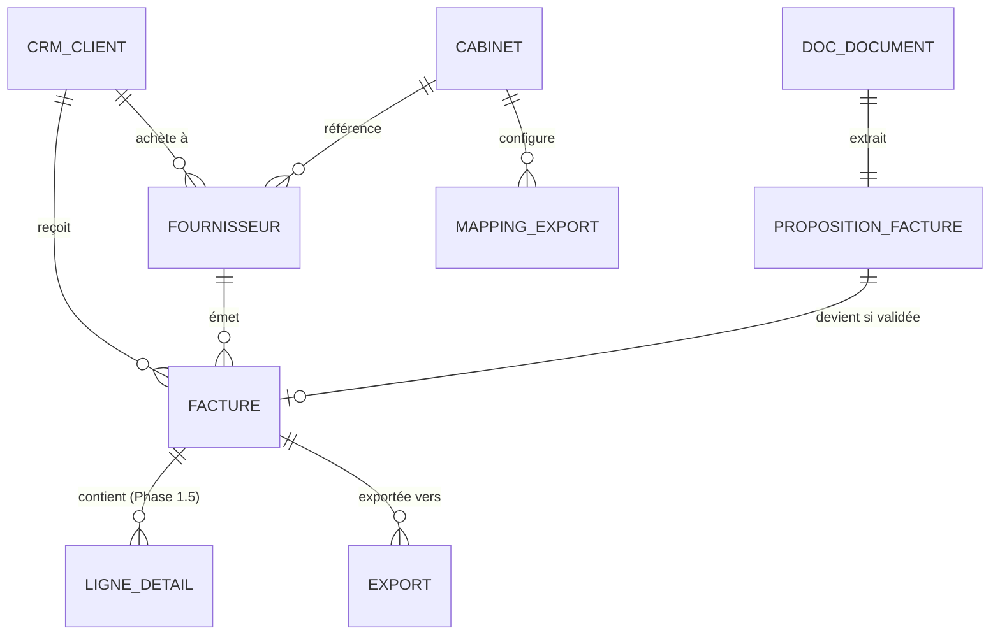

# Schéma de données — Facture

> Schéma Postgres / Supabase. Toutes les tables vivent dans `facture.*`.
> Lien : FK vers `crm.cabinet`, `crm.client`, `doc.document`, `extraction.invocation`.
>
> **Convention multi-tenant** : toutes les tables portent `cabinet_id uuid NOT NULL REFERENCES crm.cabinet(id) ON DELETE RESTRICT`. RLS génériques actives. Voir [`/docs/architecture/multi-tenant.md`](../architecture/multi-tenant.md).
>
> **Scope MVP** : factures **fournisseurs** des clients PME (achats). Pas les factures de vente (Phase 2).

---

## 1. Vue d'ensemble



> `cabinet_id` implicite partout.

---

## 2. Enums

```sql
CREATE TYPE facture.statut_proposition AS ENUM (
  'en_extraction',
  'a_valider',
  'validee',
  'rejetee_pas_facture',
  'doublon',
  'erreur'
);

CREATE TYPE facture.statut_facture AS ENUM (
  'en_attente_validation',
  'validee',
  'exportee',
  'payee',
  'litigieuse',
  'annulee'
);

CREATE TYPE facture.devise AS ENUM (
  'CHF', 'EUR', 'USD', 'GBP', 'AUTRE'
);

CREATE TYPE facture.type_facture AS ENUM (
  'facture_standard',
  'avoir',                -- note de crédit
  'rappel',
  'acompte',
  'final',
  'autre'
);

CREATE TYPE facture.statut_export AS ENUM (
  'en_attente',
  'en_cours',
  'succes',
  'echec',
  'manuel'                -- marqué résolu hors ZARYA
);
```

---

## 3. Table `facture.fournisseur`

Référentiel fournisseur par couple (cabinet, client_pme). Voir [`facture.md` § 9](../modules/facture.md) pour le rationale du scope.

| Colonne | Type | Contrainte | Description |
|---|---|---|---|
| id | uuid | PK | |
| cabinet_id | uuid | FK → cabinet NOT NULL | |
| client_id | uuid | FK crm.client NOT NULL | Le client PME concerné |
| raison_sociale | text | NOT NULL | |
| nom_court | text | | Affichage compact |
| ide | text | NULL | CHE-XXX.XXX.XXX |
| numero_tva | text | NULL | |
| adresse | jsonb | | Structure standard |
| iban_principal | text | | Chiffré (Vault) |
| iban_secondaires | text[] | | Si plusieurs IBAN historiques |
| bic | text | | |
| --- Patterns appris --- | | | |
| categorie_habituelle | text | | "telecom", "energie", "matieres_premieres"... |
| compte_charge_habituel | text | | Compte comptable suggéré |
| taux_tva_habituel | numeric(4,2) | | |
| montant_moyen | numeric(14,2) | | Pour détection anomalies |
| frequence_estimee | text | | "mensuelle", "trimestrielle", "ponctuelle" |
| --- Stats --- | | | |
| nb_factures_total | integer | DEFAULT 0 | |
| premiere_facture_at | date | | |
| derniere_facture_at | date | | |
| --- Audit IBAN --- | | | |
| iban_changements | jsonb | | Historique des changements pour audit fraude |
| --- Métadonnées --- | | | |
| notes | text | | |
| actif | boolean | NOT NULL DEFAULT true | |
| created_at | timestamptz | | |
| updated_at | timestamptz | | |

**Index** : `(cabinet_id, client_id, raison_sociale)`, `(cabinet_id, client_id, ide)` UNIQUE quand ide NOT NULL.

**Contrainte** : `UNIQUE(cabinet_id, client_id, ide)` quand `ide IS NOT NULL`.

---

## 4. Table `facture.proposition_facture`

Extraction IA en attente de validation.

| Colonne | Type | Contrainte | Description |
|---|---|---|---|
| id | uuid | PK | |
| cabinet_id | uuid | FK → cabinet NOT NULL | |
| client_id | uuid | FK crm.client NOT NULL | |
| document_id | uuid | FK doc.document UNIQUE NOT NULL | |
| extraction_invocation_id | uuid | FK extraction.invocation NOT NULL | |
| statut | enum | NOT NULL DEFAULT 'a_valider' | |
| --- Fournisseur proposé --- | | | |
| fournisseur_existant_id | uuid | FK fournisseur NULL | Si matché à existant |
| fournisseur_propose_data | jsonb | | Données extraites si nouveau |
| --- Identité facture --- | | | |
| numero_facture_propose | text | | |
| type_propose | enum | DEFAULT 'facture_standard' | |
| date_emission_proposee | date | | |
| date_echeance_proposee | date | | |
| reference_proposee | text | | |
| --- Montants --- | | | |
| total_ht_propose | numeric(14,2) | | |
| total_tva_propose | numeric(14,2) | | |
| total_ttc_propose | numeric(14,2) | | |
| montant_a_payer_propose | numeric(14,2) | | Peut différer du TTC si acompte |
| taux_tva_principal_propose | numeric(4,2) | | |
| devise_proposee | enum | DEFAULT 'CHF' | |
| --- Catégorisation --- | | | |
| categorie_proposee | text | | |
| compte_charge_propose | text | | |
| --- QR-facture --- | | | |
| qr_facture_detecte | boolean | DEFAULT false | |
| qr_facture_data | jsonb | | Données décodées brutes |
| --- Confiance --- | | | |
| confiance_globale | numeric(3,2) | | |
| confiance_par_champ | jsonb | | |
| anomalies_detectees | text[] | | |
| --- Bbox sources --- | | | |
| bbox_sources | jsonb | | Position des champs dans le PDF |
| --- Doublons --- | | | |
| doublons_potentiels | uuid[] | | FK facture existantes |
| --- Validation --- | | | |
| valide_par | uuid | FK auth.users | |
| date_validation | timestamptz | | |
| facture_id | uuid | FK facture UNIQUE | Si validée |
| rejet_motif | text | | |
| corrections_apportees | jsonb | | Diff |
| created_at | timestamptz | NOT NULL DEFAULT now | |

**Index** : `(cabinet_id, statut, created_at)`, `(document_id)`, `(client_id)`, `(facture_id)`.

---

## 5. Table `facture.facture`

Facture validée. Source de vérité.

| Colonne | Type | Contrainte | Description |
|---|---|---|---|
| id | uuid | PK | |
| cabinet_id | uuid | FK → cabinet NOT NULL | |
| client_id | uuid | FK crm.client NOT NULL | |
| fournisseur_id | uuid | FK fournisseur NOT NULL | |
| document_id | uuid | FK doc.document UNIQUE NOT NULL | |
| proposition_id | uuid | FK proposition_facture UNIQUE NULL | Null si saisie manuelle |
| --- Identité --- | | | |
| numero_facture | text | NOT NULL | |
| type | enum | NOT NULL DEFAULT 'facture_standard' | |
| date_emission | date | NOT NULL | |
| date_echeance | date | | |
| date_reception_zarya | timestamptz | NOT NULL | |
| reference_externe | text | | |
| --- Montants --- | | | |
| total_ht | numeric(14,2) | NOT NULL | |
| total_tva | numeric(14,2) | NOT NULL DEFAULT 0 | |
| total_ttc | numeric(14,2) | NOT NULL | |
| montant_a_payer | numeric(14,2) | NOT NULL | Peut différer TTC si acompte |
| taux_tva_principal | numeric(4,2) | | Pour les factures simples |
| tva_multiple | boolean | DEFAULT false | True si plusieurs taux |
| devise | enum | NOT NULL DEFAULT 'CHF' | |
| taux_change | numeric(10,6) | | Si devise != CHF |
| --- Paiement --- | | | |
| iban_paiement | text | | Chiffré (Vault) |
| reference_paiement | text | | Référence ESR/QR |
| qr_facture | boolean | DEFAULT false | |
| --- Comptabilité --- | | | |
| categorie | text | | |
| compte_charge | text | NOT NULL | Compte comptable client |
| compte_tva | text | | Compte TVA |
| centre_cout | text | | Si analytique |
| --- Statut --- | | | |
| statut | enum | NOT NULL DEFAULT 'en_attente_validation' | |
| statut_classement | text | NOT NULL | `auto`, `valide_humain`, `corrige_humain`, `manuel` |
| date_paiement_constate | date | | Phase 2 |
| date_export | timestamptz | | Quand exportée |
| --- Anti-fraude --- | | | |
| iban_change_vs_historique | boolean | DEFAULT false | Alerte fraude au RIB |
| anomalies_signalees | text[] | | |
| --- Audit --- | | | |
| cree_par | uuid | FK auth.users | Null si auto |
| created_at | timestamptz | NOT NULL DEFAULT now | |
| updated_at | timestamptz | NOT NULL DEFAULT now | |
| archived_at | timestamptz | | Soft delete |

**Index** :
- `(cabinet_id, client_id, date_emission DESC)`
- `(cabinet_id, fournisseur_id, date_emission DESC)`
- `(cabinet_id, statut)`
- `(cabinet_id, date_echeance) WHERE statut != 'payee'`
- `(document_id)`

**Contrainte** : `UNIQUE(cabinet_id, fournisseur_id, numero_facture)` pour éviter doublons (avec gestion null-safe).

**Cohérence montants** : trigger CHECK `total_ttc = total_ht + total_tva ± 0.05` (tolérance arrondis).

---

## 6. Table `facture.ligne_detail` (Phase 1.5)

Détail des lignes de facture. Hors-scope MVP, structure prévue.

| Colonne | Type | Contrainte | Description |
|---|---|---|---|
| id | uuid | PK | |
| cabinet_id | uuid | FK → cabinet NOT NULL | |
| facture_id | uuid | FK facture NOT NULL | |
| numero_ligne | integer | NOT NULL | Ordre dans la facture |
| description | text | NOT NULL | |
| quantite | numeric(10,3) | | |
| unite | text | | "pièce", "heure", "kg" |
| prix_unitaire | numeric(14,4) | | |
| total_ligne_ht | numeric(14,2) | | |
| taux_tva | numeric(4,2) | | |
| total_ligne_tva | numeric(14,2) | | |
| total_ligne_ttc | numeric(14,2) | | |
| compte_charge_specifique | text | | Override |
| centre_cout_specifique | text | | |

**Index** : `(facture_id, numero_ligne)`.

---

## 7. Table `facture.mapping_export`

Mapping des champs vers le logiciel comptable du cabinet (ou du client si configuration par client).

| Colonne | Type | Contrainte | Description |
|---|---|---|---|
| id | uuid | PK | |
| cabinet_id | uuid | FK → cabinet NOT NULL | |
| client_id | uuid | FK crm.client NULL | Null = mapping cabinet-global |
| logiciel_cible | text | NOT NULL | "bexio_compta", "cresus", "winbiz"... |
| version_logiciel | text | | |
| --- Mapping comptes --- | | | |
| compte_fournisseur_defaut | text | NOT NULL | |
| mappings_categories | jsonb | NOT NULL | {"telecom": "5800", "energie": "5810", ...} |
| mappings_tva | jsonb | NOT NULL | {"8.1": "1170", "2.6": "1171", ...} |
| centre_cout_par_client | jsonb | | Si analytique activée |
| --- Format export --- | | | |
| encodage_fichier | text | DEFAULT 'utf-8' | "utf-8", "windows-1252" pour Crésus |
| separateur_csv | text | DEFAULT ';' | |
| format_date | text | DEFAULT 'YYYY-MM-DD' | |
| format_montant | text | DEFAULT '0.00' | |
| --- Préférences --- | | | |
| mode_export | text | NOT NULL DEFAULT 'batch_hebdo' | `au_fil_eau`, `batch_hebdo`, `batch_mensuel` |
| inclure_pdf_facture | boolean | DEFAULT false | |
| actif | boolean | DEFAULT true | |
| created_at | timestamptz | | |
| updated_at | timestamptz | | |

**Index** : `(cabinet_id, client_id, logiciel_cible)`.

---

## 8. Table `facture.export`

Trace de chaque export exécuté.

| Colonne | Type | Contrainte | Description |
|---|---|---|---|
| id | uuid | PK | |
| cabinet_id | uuid | FK → cabinet NOT NULL | |
| client_id | uuid | FK crm.client NULL | Null si export multi-clients |
| mapping_id | uuid | FK mapping_export NOT NULL | |
| logiciel_cible | text | NOT NULL | |
| pattern | text | NOT NULL | `api`, `file`, `excel` |
| factures_ids | uuid[] | NOT NULL | IDs des factures exportées |
| nb_factures | integer | NOT NULL | |
| --- Pattern A (API) --- | | | |
| reponses_externes | jsonb | | IDs retournés par le logiciel cible |
| --- Pattern B/C (fichier) --- | | | |
| fichier_genere_id | uuid | FK doc.document NULL | |
| fichier_telecharge_at | timestamptz | | Quand l'utilisateur a téléchargé |
| --- Statut --- | | | |
| statut | enum | NOT NULL DEFAULT 'en_attente' | |
| erreur_message | text | | |
| --- Audit --- | | | |
| declenche_par | uuid | FK auth.users NULL | Null si batch automatique |
| created_at | timestamptz | NOT NULL DEFAULT now | |
| termine_at | timestamptz | | |

**Index** : `(cabinet_id, statut, created_at)`, `(client_id)`, GIN sur `factures_ids` pour retrouver les exports d'une facture.

---

## 9. Vues

### `facture.v_a_valider`
Vue d'inbox pour Julie.

```sql
CREATE VIEW facture.v_a_valider AS
SELECT
  p.id AS proposition_id,
  p.cabinet_id,
  p.client_id,
  c.raison_sociale AS client_nom,
  COALESCE(f_existant.raison_sociale, p.fournisseur_propose_data->>'raison_sociale') AS fournisseur_nom,
  p.numero_facture_propose,
  p.date_emission_proposee,
  p.total_ttc_propose,
  p.devise_proposee,
  p.confiance_globale,
  array_length(p.anomalies_detectees, 1) AS nb_anomalies,
  p.qr_facture_detecte,
  d.fichier_physique_id,
  p.created_at
FROM facture.proposition_facture p
JOIN crm.client c ON c.id = p.client_id
LEFT JOIN facture.fournisseur f_existant ON f_existant.id = p.fournisseur_existant_id
JOIN doc.document d ON d.id = p.document_id
WHERE p.statut = 'a_valider'
ORDER BY p.confiance_globale DESC, p.created_at DESC;
```

### `facture.v_par_client_mois`
Aggrégation par client × mois pour reporting.

### `facture.v_a_exporter`
Factures validées non encore exportées.

### `facture.v_alertes_fraude`
Factures avec `iban_change_vs_historique = true` pour alerte cabinet.

---

## 10. Triggers et fonctions

### 10.1 Validation et création de facture
Trigger sur `proposition_facture` UPDATE quand `statut = 'validee'` :
1. Créer ou enrichir `facture.fournisseur` (si nouveau)
2. Créer `facture.facture` finale
3. Mettre à jour `fournisseur.nb_factures_total`, `montant_moyen`, etc.
4. Détecter changement IBAN → si oui, marquer `iban_change_vs_historique`
5. Enregistrer dans `crm.evenement` (type `facture_validee`)
6. Recalcul potentiel `crm.risque`
7. Si export `au_fil_eau` → trigger export immédiat

### 10.2 Détection de fraude au RIB
```sql
CREATE OR REPLACE FUNCTION facture.detecter_changement_iban()
RETURNS trigger AS $$
DECLARE
  v_iban_precedent text;
BEGIN
  -- Récupérer l'IBAN principal connu du fournisseur
  SELECT iban_principal INTO v_iban_precedent
  FROM facture.fournisseur
  WHERE id = NEW.fournisseur_id;

  IF v_iban_precedent IS NOT NULL 
     AND NEW.iban_paiement IS NOT NULL
     AND NEW.iban_paiement <> v_iban_precedent THEN
    NEW.iban_change_vs_historique := true;
    
    -- Logger dans audit
    INSERT INTO audit.cabinet_evenement (cabinet_id, type, ressource_id, ressource_type, description)
    VALUES (NEW.cabinet_id, 'alerte_iban_changement', NEW.id, 'facture',
            format('IBAN différent détecté pour fournisseur %s', NEW.fournisseur_id));
  END IF;

  RETURN NEW;
END;
$$ LANGUAGE plpgsql;
```

### 10.3 Détection de doublons
Avant insertion, recherche par `(cabinet_id, fournisseur_id, numero_facture)` puis fallback par `(montant + date ± 3 jours)`. Si match → flagger dans `doublons_potentiels`.

### 10.4 Mise à jour stats fournisseur
À chaque facture validée : recalcul `montant_moyen`, `derniere_facture_at`, etc.

### 10.5 Cycle d'export batch
Job pg_cron quotidien ou hebdomadaire selon `mapping_export.mode_export` :
- Sélection des factures non exportées
- Génération du fichier ou appel API selon pattern
- Mise à jour `facture.statut = 'exportee'`
- Création `facture.export`

---

## 11. RLS

Pattern standard multi-tenant.

**Cas client final** : le contact RH client **ne voit pas** les factures fournisseurs côté MVP. Champ trop sensible (montants, fournisseurs, conditions commerciales).

Phase 2 : exposition possible via vue filtrée si le cabinet active explicitement cette feature pour son client.

---

## 12. Sécurité spécifique

### 12.1 Chiffrement applicatif
Champs Vault :
- `facture.facture.iban_paiement`
- `facture.fournisseur.iban_principal`, `iban_secondaires`

### 12.2 Audit
Toute modification d'une facture validée logguée dans `audit.cabinet_evenement` :
- Création
- Modification (avec diff)
- Validation
- Export
- Suppression (soft)

### 12.3 Anti-fraude
Voir trigger 10.2. Alertes affichées dans l'UI avec icône claire.

---

## 13. Volumétrie attendue

Pour 100 cabinets, 100 clients/cabinet en moyenne, 50 factures/mois/client à 2 ans :

| Table | Lignes estimées |
|---|---|
| fournisseur | 200 000 (cabinet × client × fournisseurs) |
| proposition_facture | 1.2M |
| facture | 1M (rejets et doublons exclus) |
| ligne_detail | 5M (Phase 1.5) |
| mapping_export | ~500 |
| export | 100K |

**Partitionnement** : `proposition_facture`, `facture`, `ligne_detail` par mois après 12 mois.

---

## 14. Migrations

```
facture/
├── 070_create_schema_facture.sql
├── 071_create_enums_facture.sql
├── 072_create_fournisseur.sql
├── 073_create_proposition_facture.sql
├── 074_create_facture.sql
├── 075_create_ligne_detail.sql
├── 076_create_mapping_export.sql
├── 077_create_export.sql
├── 078_create_views_facture.sql
├── 079_create_functions_facture.sql
├── 080_create_triggers_facture.sql
├── 081_enable_rls_facture.sql
├── 082_create_rls_policies_facture.sql
```

---

## 15. À trancher avant implémentation

- [ ] **Type `numeric`** pour les montants : `(14,2)` suffit ou besoin de plus de précision ?
- [ ] **TVA multiple** : un seul `taux_tva_principal` + détail dans `ligne_detail`, ou tableau de taux ?
- [ ] **Devise étrangère** : conversion CHF automatique au taux du jour ou taux à saisir ?
- [ ] **QR-facture parsing** : library Node disponible ou implémentation custom ?
- [ ] **Anti-doublon** : critère exact à valider en pilote (numéro + fournisseur suffit ?)
- [ ] **Historique IBAN** : jsonb append-only ou table dédiée pour audit ?
- [ ] **Compte comptable** : enum strict ou texte libre selon plan client ?
- [ ] **Multi-clients** par fournisseur : un même fournisseur réel = N entrées (1 par client) OU 1 entrée partagée par cabinet ? **Décision : N entrées, voir [`facture.md` § 9.3](../modules/facture.md)**
- [ ] **Status `payee`** : Phase 2, comment alimenter (banque, manuel, autre) ?
