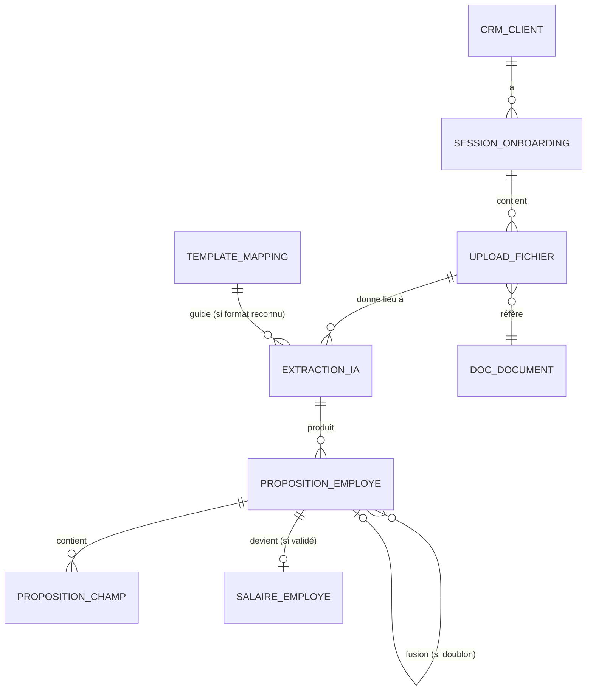

# Schéma de données — Onboarding Client

> Tables spécifiques à l'onboarding initial d'un nouveau client et à la réutilisation pour vagues d'embauches.
> Toutes les tables vivent dans le schéma `salaire.*` (extension du schéma existant).
> Lien : FK vers `crm.cabinet`, `crm.client`, `crm.contact`, `doc.document`, `salaire.employe`.
> **Multi-tenant** : toutes les tables portent un `cabinet_id`. Voir [`/docs/architecture/multi-tenant.md`](../architecture/multi-tenant.md).

---

## 1. Vue d'ensemble

> **Convention multi-tenant** : toutes les tables de ce schéma portent une colonne `cabinet_id uuid NOT NULL REFERENCES crm.cabinet(id) ON DELETE RESTRICT`. Cette colonne n'est pas répétée dans la description de chaque table pour la lisibilité — considérez-la implicite. RLS générique activée partout. Voir [`/docs/architecture/multi-tenant.md`](../architecture/multi-tenant.md).



---

## 2. Enums

```sql
CREATE TYPE salaire.statut_session_onboarding AS ENUM (
  'initialisee',           -- créée, pas encore commencée
  'etape_1_en_cours',      -- identification entreprise
  'etape_2_en_cours',      -- services et paramètres
  'etape_3_en_cours',      -- salaire
  'terminee',              -- 100% validée
  'abandonnee'             -- inactive depuis longtemps
);

CREATE TYPE salaire.statut_proposition_employe AS ENUM (
  'en_attente',            -- extraction faite, validation client requise
  'validee',               -- entièrement validée, employé créé
  'rejetee',               -- "ce n'est pas un employé"
  'fusionnee',             -- doublon détecté, fusionnée avec autre proposition
  'echec_extraction'       -- IA n'a pas pu extraire suffisamment
);

CREATE TYPE salaire.statut_proposition_champ AS ENUM (
  'propose',               -- valeur IA, pas encore validé
  'valide',                -- client a confirmé la valeur IA
  'modifie',               -- client a saisi une valeur différente
  'rejete',                -- client dit "source erronée"
  'manquant'               -- IA n'a pas trouvé, saisie manuelle requise
);

CREATE TYPE salaire.type_source_upload AS ENUM (
  'excel_structure',       -- export Bexio, Crésus, Odoo, etc.
  'excel_libre',           -- Excel maison
  'csv',
  'pdf_contrat',
  'pdf_attestation',
  'image_scan',
  'inconnu'
);

-- Catégories de modèle Infomaniak AI Services (Suisse), résolues au runtime via /v1/models
-- (aucun model_id en dur — voir ADR 0010)
CREATE TYPE salaire.type_modele_extraction AS ENUM (
  'chat_large',
  'chat_small',
  'vision',
  'autre'
);
```

---

## 3. Table `salaire.session_onboarding`

Une session par client. Persiste à travers les déconnexions.

| Colonne | Type | Contrainte | Description |
|---|---|---|---|
| id | uuid | PK | |
| client_id | uuid | FK → crm.client NOT NULL UNIQUE | 1 seule session par client |
| statut | enum | NOT NULL DEFAULT 'initialisee' | |
| date_demarrage | timestamptz | NOT NULL DEFAULT now | |
| date_derniere_activite | timestamptz | NOT NULL DEFAULT now | |
| date_fin | timestamptz | | Quand statut = terminee |
| etape_1_terminee_at | timestamptz | | Identification |
| etape_2_terminee_at | timestamptz | | Services & params |
| etape_3a_terminee_at | timestamptz | | Config paie |
| etape_3b_terminee_at | timestamptz | | Référentiel employés |
| nb_employes_attendus | integer | | Estimation saisie en étape 3a |
| nb_employes_proposes | integer | DEFAULT 0 | Total propositions IA |
| nb_employes_valides | integer | DEFAULT 0 | Total `salaire.employe` créés |
| nb_uploads | integer | DEFAULT 0 | |
| consentement_zefix | boolean | DEFAULT false | |
| consentement_zefix_at | timestamptz | | |
| consentement_nlpd_traitement | boolean | DEFAULT false | Conditions générales nLPD |
| consentement_nlpd_at | timestamptz | | |
| dernier_acteur_type | enum | | `client`, `fiduciaire` |
| dernier_acteur_id | uuid | | |
| notes_client | text | | |
| notes_fiduciaire | text | | Invisible client |
| created_at | timestamptz | | |
| updated_at | timestamptz | | |

**Index** : `(client_id)`, `(statut, date_derniere_activite)` pour relances.

---

## 4. Table `salaire.upload_fichier`

Chaque fichier uploadé pendant l'onboarding.

| Colonne | Type | Contrainte | Description |
|---|---|---|---|
| id | uuid | PK | |
| session_id | uuid | FK → session_onboarding NOT NULL | |
| document_id | uuid | FK doc.document NOT NULL | Fichier physique dans Doc |
| nom_fichier_original | text | NOT NULL | |
| taille_octets | bigint | | |
| type_mime | text | | |
| type_source_detecte | enum | | Voir `type_source_upload` |
| categorie_declaree | text | | "Liste employés", "Contrats", etc. — déclarée par utilisateur |
| uploaded_par_type | enum | NOT NULL | `client`, `fiduciaire` |
| uploaded_par_id | uuid | | |
| uploaded_at | timestamptz | NOT NULL DEFAULT now | |
| statut_extraction | enum | DEFAULT 'pending' | `pending`, `en_cours`, `termine`, `echec` |
| date_extraction_demarree | timestamptz | | |
| date_extraction_terminee | timestamptz | | |
| message_erreur | text | | |
| nb_employes_extraits | integer | | |
| utilise_template_id | uuid | FK → template_mapping NULL | Si un template a été appliqué |

**Index** : `(session_id, uploaded_at)`, `(statut_extraction)`.

---

## 5. Table `salaire.extraction_ia`

Une extraction = une passe LLM sur un fichier. Plusieurs extractions possibles par fichier (re-extraction si première mauvaise).

| Colonne | Type | Contrainte | Description |
|---|---|---|---|
| id | uuid | PK | |
| upload_fichier_id | uuid | FK → upload_fichier NOT NULL | |
| numero_passe | integer | DEFAULT 1 | 1re extraction, 2e, etc. |
| modele_utilise | enum | NOT NULL | Voir `type_modele_extraction` |
| modele_version_exacte | text | | Identifiant exact du modèle Infomaniak résolu au runtime via /v1/models (aucun model_id en dur) |
| bedrock_region | text | NOT NULL DEFAULT 'eu-central-1' | Colonne héritée (ADR 0003, conservée sous ADR 0010) ; gardée pour cohérence d'audit |
| bedrock_request_id | text | | Colonne héritée (ADR 0003, conservée sous ADR 0010) ; porte l'ID de requête Infomaniak pour cross-référence |
| prompt_version | text | | Version interne du prompt système (ex. "onboarding-extraction-v1.2.0") |
| ocr_engine | text | | "infomaniak_vision" si OCR utilisé en amont (catégorie `vision`, Phase 4.1+), null sinon |
| ocr_region | text | | "ch" (Infomaniak, Suisse) — Phase 4.1+ |
| donnees_brutes | jsonb | | Output JSON brut du LLM |
| nb_employes_detectes | integer | | |
| confiance_globale | numeric(3,2) | | Moyenne pondérée des confiances |
| date_debut | timestamptz | NOT NULL | |
| date_fin | timestamptz | | |
| duree_ms | integer | | |
| tokens_input | integer | | |
| tokens_output | integer | | |
| cout_estime_chf | numeric(8,4) | | |
| statut | enum | | `en_cours`, `succes`, `echec_partiel`, `echec_total` |
| message_erreur | text | | |
| utilise_par_passe_suivante | boolean | DEFAULT true | Si une re-extraction est lancée, l'ancienne devient false |

**Note** : la table garde **toutes** les passes pour audit et amélioration des prompts. Indexée par `(upload_fichier_id, numero_passe DESC)`.

---

## 6. Table `salaire.proposition_employe`

Proposition d'employé extraite par l'IA, en attente de validation client.

| Colonne | Type | Contrainte | Description |
|---|---|---|---|
| id | uuid | PK | |
| session_id | uuid | FK → session_onboarding NOT NULL | |
| extraction_id | uuid | FK → extraction_ia NOT NULL | Extraction d'origine |
| numero_dans_extraction | integer | | Ordre dans le fichier (ligne 1, 2, 3...) |
| statut | enum | NOT NULL DEFAULT 'en_attente' | |
| confiance_globale | numeric(3,2) | | Moyenne des confiances de tous les champs |
| anomalies_detectees | jsonb | | ["salaire_aberrant", "date_future", "avs_invalide"...] |
| doublons_potentiels | uuid[] | | FK vers autres `proposition_employe` |
| fusionnee_avec_id | uuid | FK → proposition_employe | Si statut = fusionnee |
| employe_id | uuid | FK → salaire.employe UNIQUE | Si statut = validee, l'employé créé |
| rejetee_motif | text | | Si statut = rejetee |
| sources_documents | uuid[] | | UUIDs des `upload_fichier` qui ont contribué (fusion) |
| date_validation | timestamptz | | |
| valide_par_type | enum | | `client`, `fiduciaire` |
| valide_par_id | uuid | | |
| created_at | timestamptz | NOT NULL DEFAULT now | |
| updated_at | timestamptz | NOT NULL DEFAULT now | |

**Index** : `(session_id, statut)`, `(employe_id)`.

---

## 7. Table `salaire.proposition_champ`

Granularité maximale : 1 ligne = 1 champ proposé pour 1 employé.

| Colonne | Type | Contrainte | Description |
|---|---|---|---|
| id | uuid | PK | |
| proposition_employe_id | uuid | FK → proposition_employe NOT NULL | |
| nom_champ | text | NOT NULL | "prenom", "nom", "numero_avs", "salaire_base_mensuel"... |
| categorie | enum | | `identite`, `coordonnees`, `statut_admin`, `contrat`, `remuneration` |
| valeur_proposee | text | | Valeur extraite par l'IA (toujours en text, casté à l'application) |
| valeur_proposee_normalisee | jsonb | | Version structurée si nécessaire (dates, montants typés) |
| confiance | numeric(3,2) | NOT NULL | 0.00 à 1.00 |
| source_document_id | uuid | FK doc.document | Document d'origine |
| source_page | integer | | Page (PDF) ou onglet (Excel) |
| source_bbox | jsonb | | Coordonnées de la zone {x, y, width, height} pour PDF |
| source_cellule | text | | "B7" pour Excel/CSV |
| source_texte_extrait | text | | Le texte brut autour de l'extraction |
| obligatoire_swissdec | boolean | DEFAULT false | True pour les champs Swissdec-ready |
| statut | enum | NOT NULL DEFAULT 'propose' | |
| valeur_finale | text | | Valeur après validation/modification |
| modifie_par_type | enum | | Si statut != propose |
| modifie_par_id | uuid | | |
| date_validation | timestamptz | | |
| created_at | timestamptz | | |
| updated_at | timestamptz | | |

**Index** : `(proposition_employe_id, statut)`, `(proposition_employe_id, obligatoire_swissdec)`.

**Contrainte** : `UNIQUE(proposition_employe_id, nom_champ)`.

---

## 8. Table `salaire.template_mapping`

Templates pré-définis pour mapper des formats sources connus vers les champs ZARYA. Vide au MVP, alimentée au fil des cabinets onboardés.

| Colonne | Type | Contrainte | Description |
|---|---|---|---|
| id | uuid | PK | |
| code | text | UNIQUE NOT NULL | "odoo_hr_export_v17", "bexio_payroll_export_2025", "sap_successfactors", "tipee_csv"... |
| nom | text | NOT NULL | "Odoo HR Export v17" |
| description | text | | |
| version | text | | |
| logiciel_source | text | | "Odoo", "Bexio", "SAP", "Tipee", "Crésus", "WinBIZ", "OfficeMaker" |
| format_fichier | enum | | `xlsx`, `csv`, `xml`, `json` |
| mapping_colonnes | jsonb | NOT NULL | { "AVS Number": "numero_avs", "First Name": "prenom"... } |
| regles_normalisation | jsonb | | Règles de transformation (format date, devise, etc.) |
| nb_utilisations | integer | DEFAULT 0 | Compteur d'usage |
| taux_succes | numeric(3,2) | | % d'extractions validées sans modification |
| actif | boolean | DEFAULT true | |
| cree_par | uuid | FK auth.users | Membre Condere qui a créé le template |
| created_at | timestamptz | | |
| updated_at | timestamptz | | |

---

## 9. Table `salaire.zefix_recherche`

Trace des appels Zefix pour audit nLPD.

| Colonne | Type | Contrainte | Description |
|---|---|---|---|
| id | uuid | PK | |
| session_id | uuid | FK → session_onboarding NOT NULL | |
| requete | text | NOT NULL | IDE ou nom recherché |
| nb_resultats | integer | | |
| ide_selectionne | text | | IDE choisi parmi les résultats |
| reponse_brute | jsonb | | Pour audit |
| consentement_donne | boolean | NOT NULL | |
| date_appel | timestamptz | NOT NULL DEFAULT now | |
| acteur_type | enum | | `client`, `fiduciaire` |
| acteur_id | uuid | | |

---

## 10. Évolution de la table `salaire.employe`

**Colonnes à ajouter** (migration sur le schéma existant) :

| Colonne | Type | Description |
|---|---|---|
| cree_via_onboarding | boolean DEFAULT false | True si créé via session d'onboarding |
| session_onboarding_id | uuid FK → session_onboarding | Quelle session |
| proposition_employe_id | uuid FK → proposition_employe UNIQUE | Quelle proposition validée |
| documents_sources | uuid[] | Documents qui ont contribué à la création |
| confiance_globale_initiale | numeric(3,2) | Confiance IA au moment de la validation |
| ids_externes | jsonb | { "bexio": "12345", "odoo": "EMP-007", "sap": "SAP123" } |
| derniere_synchronisation | jsonb | { "bexio": "2026-05-20T14:23:00Z", ... } |

---

## 11. Vues utiles

### `salaire.v_session_onboarding_progress`
Pour le dashboard client : statut + progression %.

```sql
CREATE VIEW salaire.v_session_onboarding_progress AS
SELECT 
  s.id,
  s.client_id,
  c.raison_sociale,
  s.statut,
  CASE
    WHEN s.etape_3b_terminee_at IS NOT NULL THEN 100
    WHEN s.etape_3a_terminee_at IS NOT NULL THEN 80
    WHEN s.etape_2_terminee_at IS NOT NULL THEN 60
    WHEN s.etape_1_terminee_at IS NOT NULL THEN 40
    ELSE 20
  END AS progression_pct,
  s.nb_employes_attendus,
  s.nb_employes_valides,
  CASE
    WHEN s.nb_employes_attendus > 0 
      THEN (s.nb_employes_valides::float / s.nb_employes_attendus * 100)::int
    ELSE 0
  END AS employes_progression_pct,
  s.date_demarrage,
  s.date_derniere_activite
FROM salaire.session_onboarding s
JOIN crm.client c ON c.id = s.client_id;
```

### `salaire.v_propositions_a_valider`
Propositions en attente pour le client connecté (RLS scoped).

### `salaire.v_extractions_a_relancer`
Sessions inactives depuis 7+ jours pour notifications.

---

## 12. Triggers et fonctions

### Création automatique de session
Trigger sur `crm.client` INSERT → crée automatiquement une `salaire.session_onboarding` en statut `initialisee`.

### Validation d'une proposition → création de l'employé
Trigger sur `salaire.proposition_employe` UPDATE quand `statut` passe à `validee` :
1. Vérifier que tous les champs `obligatoire_swissdec = true` sont en statut `valide` ou `modifie`
2. Si oui → créer `salaire.employe` avec les valeurs finales
3. Lier `proposition_employe.employe_id`
4. Si non → REJECT avec message "champs obligatoires manquants : ..."

### Détection automatique de doublons
À l'INSERT d'une `proposition_employe` :
- Recherche par AVS si présent
- Sinon par nom + prénom + date de naissance
- Si match avec confiance > 0.85 → marquer `doublons_potentiels` et alerter

### Terminer la session
Quand toutes les propositions sont `validee` ou `rejetee` ET tous les employés actifs sont créés :
- `salaire.session_onboarding.statut = 'terminee'`
- Déblocage des workflows mensuels (création période possible)
- Notification au gestionnaire fiduciaire

### Relance après inactivité
Job quotidien :
- Sessions en `etape_*_en_cours` avec `date_derniere_activite < today - 7 days` → notification email
- Sessions avec `< today - 30 days` → passage en `abandonnee`

---

## 13. RLS

Pattern standard multi-tenant : 4 policies génériques `tenant_isolation_*` sur toutes les tables, filtrant par `cabinet_id = current_cabinet_id()`. Voir [`/docs/architecture/multi-tenant.md` § 5](../architecture/multi-tenant.md).

**Cas spécial : contact client en cours d'onboarding**. Le contact RH client en train de remplir son onboarding accède via une policy additive :

```sql
CREATE POLICY "client_contact_voit_sa_session" ON salaire.session_onboarding
  FOR ALL
  USING (
    cabinet_id = current_cabinet_id()  -- vue fiduciaire standard
    OR
    client_id IN (                      -- accès client final
      SELECT client_id FROM salaire.acces_client
      WHERE auth_user_id = auth.uid() AND actif = true
    )
  );
```

Idem sur `upload_fichier`, `extraction_ia`, `proposition_employe`, `proposition_champ`, `zefix_recherche` (avec JOIN ou colonne `cabinet_id` directe selon la table).

**Champs invisibles au client** :
- `session_onboarding.notes_fiduciaire`
- Détails internes de coût (`extraction_ia.cout_estime_chf`, `tokens_*`)
- Logs d'audit `evenement`

Exposés uniquement via vues filtrées au rôle `client_contact`.

---

## 14. Politique de rétention

**Fichiers sources uploadés** :
- Conservés indéfiniment dans Doc Storage tant que la session est active
- Après `terminee`, gardés 6 mois pour audit puis archivés en cold storage
- Suppression possible sur demande client (RGPD/nLPD)

**Données brutes d'extraction** (`extraction_ia.donnees_brutes`, `proposition_champ.*`) :
- Conservées 12 mois après `session.terminee`
- Servent à améliorer les prompts et identifier les régressions
- Anonymisées (suppression des valeurs nominatives) après 12 mois, hash de la structure conservé pour stats

**Logs Zefix** (`zefix_recherche`) :
- Conservés 5 ans (preuve du consentement)

---

## 15. Volumétrie attendue

Pour 1 cabinet, 50 clients onboardés progressivement sur 2 ans (~5 nouveaux/mois) :

| Table | Lignes estimées à 2 ans |
|---|---|
| session_onboarding | 50 |
| upload_fichier | ~250 (5 fichiers moyens par session) |
| extraction_ia | ~300 (~1.2 passes par fichier) |
| proposition_employe | ~250 (50 clients × 5 employés moyens) |
| proposition_champ | ~5 000 (250 × 20 champs) |
| template_mapping | ~10 (créés au fur et à mesure) |
| zefix_recherche | ~80 |

**Total < 50 Mo.** Aucun stress technique. La table critique est `proposition_champ` qui peut grossir si on garde l'historique long.

---

## 16. Migrations

```
salaire/onboarding/
├── 030_create_enums_onboarding.sql
├── 031_create_session_onboarding.sql
├── 032_create_upload_fichier.sql
├── 033_create_extraction_ia.sql
├── 034_create_proposition_employe.sql
├── 035_create_proposition_champ.sql
├── 036_create_template_mapping.sql
├── 037_create_zefix_recherche.sql
├── 038_alter_employe_add_onboarding_fields.sql
├── 039_create_views_onboarding.sql
├── 040_create_functions_onboarding.sql
├── 041_create_triggers_onboarding.sql
├── 042_enable_rls_onboarding.sql
├── 043_create_rls_policies_onboarding.sql
```

---

## 17. À trancher avant implémentation

- [ ] **Stockage du prompt système** : versionné dans le code (migrations) ou en DB (`prompt_template` table) ?
- [ ] **Coût de l'extraction** : facturé au cabinet (par employé extrait) ou inclus dans l'abonnement ZARYA ?
- [ ] **Quotas** : nb max d'uploads / extractions par session pour éviter abus ?
- [ ] **Format des bbox PDF** : standard PDF.js, PyMuPDF, ou propriétaire ?
- [ ] **Politique en cas d'échec OCR** : retry auto avec autre engine, ou échec immédiat avec message au client ?
- [ ] **Validation AVS** : checksum mod-11 côté DB (constraint) ou app uniquement ?
- [ ] **Données nominatives extraites** : chiffrement applicatif additionnel (Supabase Vault) sur les champs sensibles (AVS, IBAN) ?
- [ ] **Migration depuis ZARYA d'un autre cabinet** : workflow d'import inter-cabinets (rare mais possible) ?
