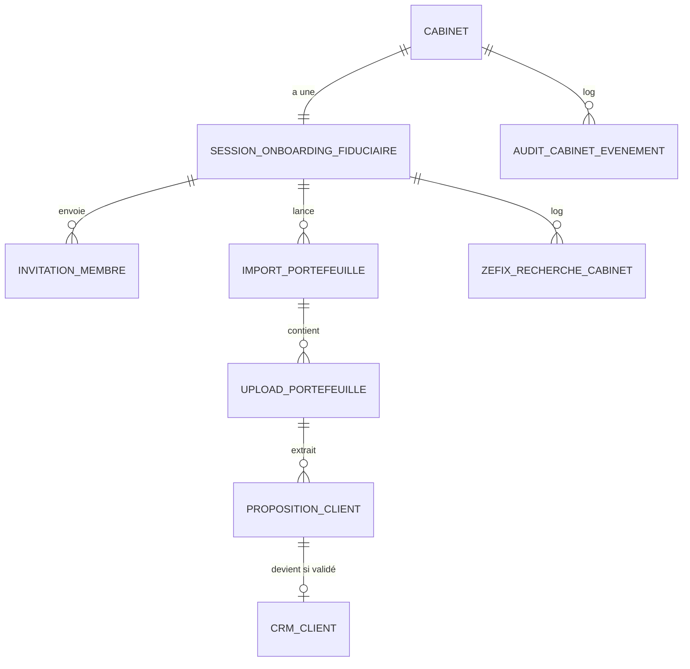

# Schéma de données — Onboarding Fiduciaire

> Tables spécifiques à l'onboarding initial d'un **cabinet** sur ZARYA.
> Toutes les tables vivent dans le schéma `crm.*` (extension du schéma cabinet).
> Lien : FK vers `crm.cabinet`, `crm.cabinet_membre`, `doc.document`.
>
> **Note multi-tenant** : ces tables sont **scopées par `cabinet_id`** comme le reste, mais avec une particularité : pendant l'étape d'inscription (avant que `crm.cabinet` ne soit complétée), certaines lignes peuvent référencer un cabinet en cours de création. Les RLS gèrent ce cas en autorisant `auth.uid() = created_by`.

---

## 1. Vue d'ensemble



> **Convention multi-tenant** : `cabinet_id` implicite sur toutes les tables (NOT NULL FK → crm.cabinet, ON DELETE RESTRICT). RLS génériques actives. Voir [`/docs/architecture/multi-tenant.md`](../architecture/multi-tenant.md).

---

## 2. Enums

```sql
CREATE TYPE crm.statut_session_onboarding_fiduciaire AS ENUM (
  'inscrit',                  -- compte créé, email pas vérifié
  'email_verifie',
  'etape_a_en_cours',         -- identité cabinet
  'etape_a_terminee',
  'etape_b_en_cours',         -- équipe
  'etape_b_terminee',
  'etape_c_en_cours',         -- branding
  'etape_c_terminee',
  'etape_d_en_cours',         -- paramètres métier
  'etape_d_terminee',
  'etape_e_en_cours',         -- intégrations
  'etape_e_terminee',
  'etape_f_en_cours',         -- import portefeuille
  'etape_f_terminee',
  'etape_f_differee',         -- choisi de faire plus tard
  'paiement_configure',
  'actif',                    -- onboarding complet, cabinet opérationnel
  'abandonne',                -- inactif depuis 30 jours
  'suspendu',
  'archive'
);

CREATE TYPE crm.statut_invitation_membre AS ENUM (
  'envoyee',
  'lue',
  'acceptee',
  'expiree',
  'refusee',
  'annulee'
);

CREATE TYPE crm.statut_import_portefeuille AS ENUM (
  'planifie',                 -- call CSM réservé
  'en_cours',                 -- session active
  'extraction_terminee',      -- IA a fini, validation en cours
  'valide',                   -- clients créés
  'echec',
  'differe'                   -- cabinet a choisi self-service
);

CREATE TYPE crm.statut_proposition_client AS ENUM (
  'en_attente',
  'validee',
  'rejetee',
  'fusionnee'
);
```

---

## 3. Table `crm.session_onboarding_fiduciaire`

Une session par cabinet. Suit toute la progression du wizard.

| Colonne | Type | Contrainte | Description |
|---|---|---|---|
| id | uuid | PK | |
| cabinet_id | uuid | FK → cabinet UNIQUE NOT NULL | 1 session par cabinet |
| statut | enum | NOT NULL DEFAULT 'inscrit' | |
| date_inscription | timestamptz | NOT NULL DEFAULT now | |
| date_verification_email | timestamptz | | |
| date_derniere_activite | timestamptz | NOT NULL DEFAULT now | |
| date_completion | timestamptz | | Quand statut = actif |
| etape_a_terminee_at | timestamptz | | |
| etape_b_terminee_at | timestamptz | | |
| etape_c_terminee_at | timestamptz | | |
| etape_d_terminee_at | timestamptz | | |
| etape_e_terminee_at | timestamptz | | |
| etape_f_terminee_at | timestamptz | | |
| etape_f_differee_at | timestamptz | | |
| consentement_cgu | boolean | NOT NULL DEFAULT false | |
| consentement_cgu_at | timestamptz | | |
| consentement_zefix | boolean | DEFAULT false | |
| consentement_zefix_at | timestamptz | | |
| code_parrainage_utilise | text | | |
| ip_inscription | inet | | Pour audit/anti-fraude |
| user_agent_inscription | text | | |
| utm_source | text | | |
| utm_campaign | text | | |
| utm_medium | text | | |
| plan_choisi | enum | | `starter`, `pro`, `enterprise`, `essai` |
| paiement_configure | boolean | DEFAULT false | |
| paiement_configure_at | timestamptz | | |
| date_fin_essai | timestamptz | | |
| notes_csm | text | | Notes prises par le CSM ZARYA pendant l'accompagnement |
| created_at | timestamptz | | |
| updated_at | timestamptz | | |

**Index** : `(cabinet_id)`, `(statut, date_derniere_activite)` pour relances, `(statut)` pour stats.

---

## 4. Table `crm.invitation_membre`

Invitations envoyées aux membres du cabinet pendant l'étape B.

| Colonne | Type | Contrainte | Description |
|---|---|---|---|
| id | uuid | PK | |
| cabinet_id | uuid | FK → cabinet NOT NULL | |
| session_id | uuid | FK → session_onboarding_fiduciaire | Null si invitation hors onboarding initial |
| email | text | NOT NULL | |
| prenom | text | | |
| nom | text | | |
| role_propose | enum | NOT NULL | `responsable`, `gestionnaire_salaires`, `collaborateur`, `lecteur` |
| specialisation | text[] | | |
| token | text | UNIQUE NOT NULL | Magic link token |
| token_expire_at | timestamptz | NOT NULL | DEFAULT now + 7 days |
| statut | enum | NOT NULL DEFAULT 'envoyee' | |
| date_envoi | timestamptz | NOT NULL DEFAULT now | |
| date_lecture | timestamptz | | |
| date_acceptation | timestamptz | | |
| date_refus | timestamptz | | |
| cabinet_membre_id | uuid | FK → cabinet_membre | Quand l'invitation est acceptée |
| envoyee_par | uuid | FK auth.users | Responsable qui a invité |
| relance_count | integer | DEFAULT 0 | Nb de relances envoyées |
| derniere_relance_at | timestamptz | | |

**Index** : `(token)`, `(cabinet_id, statut)`, `(email)`.

**Contrainte** : `UNIQUE(cabinet_id, email)` quand `statut = 'envoyee'` (pas deux invitations actives pour le même email).

---

## 5. Table `crm.import_portefeuille`

Une session d'import du portefeuille existant. Une par tentative (un cabinet peut faire plusieurs imports si rejet partiel ou ajout ultérieur).

| Colonne | Type | Contrainte | Description |
|---|---|---|---|
| id | uuid | PK | |
| cabinet_id | uuid | FK → cabinet NOT NULL | |
| session_id | uuid | FK → session_onboarding_fiduciaire | |
| numero | integer | NOT NULL DEFAULT 1 | 1er import, 2e, etc. |
| mode | enum | NOT NULL | `live_avec_csm`, `self_service` |
| statut | enum | NOT NULL DEFAULT 'planifie' | |
| date_planifiee | timestamptz | | Si mode = live_avec_csm |
| date_demarrage | timestamptz | | |
| date_completion | timestamptz | | |
| csm_user_id | uuid | FK auth.users | Le CSM ZARYA si accompagnement |
| nb_clients_proposes | integer | DEFAULT 0 | |
| nb_clients_valides | integer | DEFAULT 0 | |
| nb_clients_rejetes | integer | DEFAULT 0 | |
| logiciel_source_declare | text | | "Bexio CRM export", "Excel maison", "Abacus export"... |
| notes | text | | |
| created_at | timestamptz | | |

**Index** : `(cabinet_id, numero)`, `(statut, date_planifiee)`.

---

## 6. Table `crm.upload_portefeuille`

Fichiers uploadés pendant un import portefeuille.

| Colonne | Type | Contrainte | Description |
|---|---|---|---|
| id | uuid | PK | |
| cabinet_id | uuid | FK → cabinet NOT NULL | |
| import_id | uuid | FK → import_portefeuille NOT NULL | |
| document_id | uuid | FK doc.document NOT NULL | Fichier dans Doc Storage |
| nom_fichier_original | text | NOT NULL | |
| taille_octets | bigint | | |
| type_mime | text | | |
| type_source_detecte | text | | "excel_bexio_crm_v2", "excel_libre", "csv_abacus"... |
| nb_lignes_detectees | integer | | |
| uploaded_par | uuid | FK auth.users | Responsable cabinet ou CSM |
| uploaded_at | timestamptz | NOT NULL DEFAULT now | |
| statut_extraction | enum | DEFAULT 'pending' | `pending`, `en_cours`, `termine`, `echec` |
| extraction_id | uuid | FK extraction_ia | Réutilise le pipeline IA partagé |

---

## 7. Table `crm.proposition_client`

Propositions de clients extraites par l'IA, en attente de validation par le responsable du cabinet.

| Colonne | Type | Contrainte | Description |
|---|---|---|---|
| id | uuid | PK | |
| cabinet_id | uuid | FK → cabinet NOT NULL | |
| import_id | uuid | FK → import_portefeuille NOT NULL | |
| upload_id | uuid | FK → upload_portefeuille NOT NULL | |
| numero_dans_upload | integer | | Ordre dans le fichier source |
| statut | enum | NOT NULL DEFAULT 'en_attente' | |
| raison_sociale_proposee | text | NOT NULL | |
| type_propose | enum | | `pme`, `independant`, `prive`, `association` |
| ide_propose | text | | |
| adresse_proposee | jsonb | | |
| contacts_proposes | jsonb | | Tableau de contacts détectés |
| service_propose | text[] | | |
| confiance_globale | numeric(3,2) | | |
| anomalies_detectees | jsonb | | ["ide_invalide", "doublon_probable"...] |
| doublons_potentiels | uuid[] | | FK vers autres `proposition_client` |
| client_id | uuid | FK → crm.client UNIQUE | Si validée, le client créé |
| date_validation | timestamptz | | |
| valide_par | uuid | FK auth.users | |
| rejet_motif | text | | Si statut = rejetee |
| created_at | timestamptz | | |

**Index** : `(import_id, statut)`, `(client_id)`.

**Note** : pas de table `proposition_champ_client` séparée comme pour les employés. Les clients ont moins de champs critiques, validation en lot acceptable. Les détails sont dans `*_propose` jsonb. Si validation granulaire nécessaire en Phase 2, on ajoutera.

---

## 8. Table `crm.zefix_recherche_cabinet`

Trace des appels Zefix pour audit nLPD (équivalent de la table existante pour les clients, mais ici pour le cabinet lui-même).

| Colonne | Type | Contrainte | Description |
|---|---|---|---|
| id | uuid | PK | |
| session_id | uuid | FK → session_onboarding_fiduciaire | |
| cabinet_id | uuid | FK → cabinet NULL | Null si cabinet pas encore créé au moment de la recherche |
| requete | text | NOT NULL | |
| nb_resultats | integer | | |
| ide_selectionne | text | | |
| reponse_brute | jsonb | | |
| consentement_donne | boolean | NOT NULL | |
| date_appel | timestamptz | NOT NULL DEFAULT now | |
| ip_origine | inet | | |

---

## 9. Table `audit.cabinet_evenement`

Journal append-only des actions sur un cabinet (au-delà du standard `crm.evenement` qui couvre les clients).

| Colonne | Type | Contrainte | Description |
|---|---|---|---|
| id | uuid | PK | |
| cabinet_id | uuid | FK → crm.cabinet NOT NULL | |
| type | enum | NOT NULL | Voir ci-dessous |
| acteur_type | enum | | `cabinet_membre`, `csm_zarya`, `systeme` |
| acteur_id | uuid | | |
| description | text | | |
| metadata | jsonb | | |
| ip | inet | | |
| user_agent | text | | |
| created_at | timestamptz | NOT NULL DEFAULT now | |

**Enum `audit.type_cabinet_evenement`** :
```sql
CREATE TYPE audit.type_cabinet_evenement AS ENUM (
  'cabinet_cree',
  'email_verifie',
  'etape_terminee',
  'membre_invite',
  'membre_acceptation_invitation',
  'membre_acceptation_refus',
  'integration_configuree',
  'integration_revoquee',
  'modele_personnalise',
  'modele_reinitialise',
  'import_portefeuille_planifie',
  'import_portefeuille_lance',
  'import_portefeuille_termine',
  'plan_souscrit',
  'plan_change',
  'paiement_echec',
  'consentement_donne',
  'consentement_revoque',
  'zefix_appele',
  'login_responsable',
  'login_membre',
  'parametres_modifies'
);
```

**Index** : `(cabinet_id, created_at DESC)`, `(type)`.

**Rétention** : 6 ans (exigence audit fiduciaire).

---

## 10. Vues utiles

### `crm.v_onboarding_fiduciaire_progress`
Dashboard interne ZARYA : progression de tous les cabinets en cours d'onboarding.

```sql
CREATE VIEW crm.v_onboarding_fiduciaire_progress AS
SELECT
  s.cabinet_id,
  c.raison_sociale,
  s.statut,
  CASE
    WHEN s.statut = 'actif' THEN 100
    WHEN s.etape_f_terminee_at IS NOT NULL OR s.etape_f_differee_at IS NOT NULL THEN 90
    WHEN s.etape_e_terminee_at IS NOT NULL THEN 80
    WHEN s.etape_d_terminee_at IS NOT NULL THEN 65
    WHEN s.etape_c_terminee_at IS NOT NULL THEN 50
    WHEN s.etape_b_terminee_at IS NOT NULL THEN 35
    WHEN s.etape_a_terminee_at IS NOT NULL THEN 20
    WHEN s.date_verification_email IS NOT NULL THEN 10
    ELSE 5
  END AS progression_pct,
  s.date_derniere_activite,
  EXTRACT(epoch FROM (now() - s.date_derniere_activite)) / 86400 AS jours_inactivite
FROM crm.session_onboarding_fiduciaire s
JOIN crm.cabinet c ON c.id = s.cabinet_id
WHERE s.statut NOT IN ('actif', 'abandonne', 'archive');
```

### `crm.v_cabinets_a_relancer`
Cabinets inactifs depuis 3+ jours qui n'ont pas terminé l'onboarding. Pour les emails de relance automatiques.

### `crm.v_imports_portefeuille_planifies`
Imports planifiés à venir, pour le calendrier CSM.

---

## 11. Triggers et fonctions

### 11.1 Provisioning automatique d'un cabinet
À l'INSERT sur `crm.cabinet`, fonction qui initialise :

```sql
CREATE OR REPLACE FUNCTION crm.provision_nouveau_cabinet()
RETURNS trigger AS $$
BEGIN
  -- 1. Créer la session d'onboarding fiduciaire
  INSERT INTO crm.session_onboarding_fiduciaire (cabinet_id, statut)
  VALUES (NEW.id, 'inscrit');

  -- 2. Logger l'événement
  INSERT INTO audit.cabinet_evenement (cabinet_id, type, acteur_type, description)
  VALUES (NEW.id, 'cabinet_cree', 'systeme', 'Cabinet créé suite à inscription');

  -- 3. Pas de seed direct ici (les templates ZARYA sont en cabinet_id = NULL,
  --    hérités automatiquement par la logique applicative)

  RETURN NEW;
END;
$$ LANGUAGE plpgsql;

CREATE TRIGGER trg_provision_nouveau_cabinet
  AFTER INSERT ON crm.cabinet
  FOR EACH ROW EXECUTE FUNCTION crm.provision_nouveau_cabinet();
```

### 11.2 Activation cabinet
Trigger sur `crm.session_onboarding_fiduciaire` UPDATE quand `statut` passe à `actif` :
- Met à jour `crm.cabinet.onboarding_termine = true`
- Met à jour `crm.cabinet.onboarding_termine_at = now()`
- Log dans `audit.cabinet_evenement`
- Envoi email de bienvenue (via job async)

### 11.3 Détection d'inactivité
Job quotidien :
- Sessions en `etape_*_en_cours` avec `date_derniere_activite < today - 3 days` → email de relance
- Sessions inactives depuis 30 jours → statut `abandonne`

### 11.4 Validation d'une proposition_client
Trigger sur `proposition_client` UPDATE quand `statut` passe à `validee` :
1. Vérifier qu'aucun champ obligatoire (raison sociale, type, langue) n'est NULL
2. Créer `crm.client` avec les valeurs proposées
3. Lier `proposition_client.client_id`
4. Si jsonb `contacts_proposes` non vide → créer les `crm.contact` correspondants

### 11.5 Expiration des invitations
Job quotidien : invitations avec `token_expire_at < now` et `statut = 'envoyee'` → statut `expiree`.

---

## 12. RLS

Pattern standard multi-tenant pour les tables principales (4 policies génériques `tenant_isolation_*`).

**Cas particulier : période de création du cabinet**. Pendant le sign-up (avant que `crm.cabinet` ne soit complètement créée), le responsable doit pouvoir accéder à sa session via `auth.uid()` directement, pas via `current_cabinet_id()` (qui pourrait ne pas être encore résolu).

```sql
CREATE POLICY "session_visible_pendant_creation" ON crm.session_onboarding_fiduciaire
  FOR SELECT
  USING (
    cabinet_id = current_cabinet_id()  -- cas standard
    OR
    cabinet_id IN (                     -- cas inscription en cours
      SELECT id FROM crm.cabinet WHERE created_by = auth.uid()
    )
  );
```

Idem pour `invitation_membre`, `zefix_recherche_cabinet` accessibles via cette pattern.

**Cas CSM ZARYA** : un membre de l'équipe ZARYA (rôle `csm_zarya`) doit pouvoir accéder aux sessions actives qui nécessitent un import live. Pas de policy générique exposant tous les cabinets — accès contrôlé via une vue dédiée `internal.v_csm_dashboard` avec filtrage strict.

---

## 13. Volumétrie attendue

Pour ZARYA SaaS avec 100 cabinets onboardés sur 2 ans (5-10 nouveaux/mois) :

| Table | Lignes estimées |
|---|---|
| session_onboarding_fiduciaire | 100 |
| invitation_membre | ~500 (5 membres moyens par cabinet, +/- relances) |
| import_portefeuille | ~120 (1.2 par cabinet en moyenne) |
| upload_portefeuille | ~300 |
| proposition_client | ~10 000 (50-200 par import × ~100 imports) |
| zefix_recherche_cabinet | ~150 |
| audit.cabinet_evenement | ~50 000 (500 événements par cabinet sur 2 ans) |

**Total < 100 Mo.** Aucun stress. `audit.cabinet_evenement` à partitionner par année après 3-5 ans.

---

## 14. Migrations

```
crm/onboarding-fiduciaire/
├── 050_create_enums_onboarding_fiduciaire.sql
├── 051_create_session_onboarding_fiduciaire.sql
├── 052_create_invitation_membre.sql
├── 053_create_import_portefeuille.sql
├── 054_create_upload_portefeuille.sql
├── 055_create_proposition_client.sql
├── 056_create_zefix_recherche_cabinet.sql
├── 057_create_audit_cabinet_evenement.sql
├── 058_create_views_onboarding_fiduciaire.sql
├── 059_create_functions_onboarding_fiduciaire.sql
├── 060_create_triggers_onboarding_fiduciaire.sql
├── 061_enable_rls_onboarding_fiduciaire.sql
├── 062_create_rls_policies_onboarding_fiduciaire.sql
```

---

## 15. À trancher avant implémentation

- [ ] **Cycle de vie du token** d'invitation membre : 7 jours suffisant ? Possibilité de re-générer ?
- [ ] **Format jsonb `contacts_proposes`** dans `proposition_client` : structure exacte ?
- [ ] **Stockage des credentials Stripe** : Stripe Customer ID dans `cabinet` ou table dédiée ?
- [ ] **Limites par plan** : où sont-elles enforcées (DB constraint ou app) ?
- [ ] **Multi-import portefeuille** : un cabinet peut-il faire un 2e import 6 mois plus tard avec d'autres clients ? Workflow ?
- [ ] **Sessions abandonnées** : suppression au bout de combien de temps (RGPD) ?
- [ ] **Mode test/sandbox** : un cabinet peut-il avoir un compte sandbox parallèle pour formation ?
- [ ] **Audit `cabinet_evenement` vs `crm.evenement`** : faut-il vraiment deux journaux ou fusionner ?
