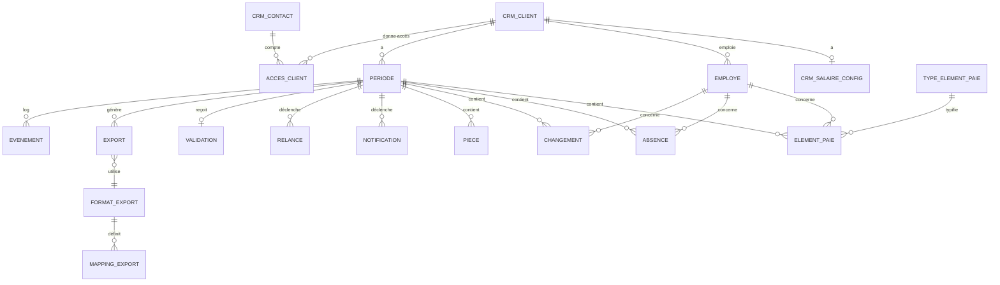

# Schéma de données — Salaire

> Schéma Postgres / Supabase. Toutes les tables vivent dans `salaire.*`.
> Lien avec le CRM : FK directes vers `crm.cabinet`, `crm.client`, `crm.contact`, `crm.salaire_config`, `doc.document`. Même base, joins natifs.
> **Multi-tenant** : toutes les tables portent un `cabinet_id`. Voir [`/docs/architecture/multi-tenant.md`](../architecture/multi-tenant.md).
> Conventions : `snake_case`, PK `id uuid default gen_random_uuid()`, timestamps `created_at` / `updated_at` partout.

---

## 1. Vue d'ensemble — entités

> **Convention multi-tenant** : toutes les tables de ce schéma portent une colonne `cabinet_id uuid NOT NULL REFERENCES crm.cabinet(id) ON DELETE RESTRICT`, dénormalisée pour permettre des RLS efficaces sans JOIN. Cette colonne n'est pas répétée dans la description de chaque table ci-dessous pour la lisibilité — considérez-la implicite. Voir [`/docs/architecture/multi-tenant.md`](../architecture/multi-tenant.md) pour le détail.
>
> **Trigger de cohérence** : à l'INSERT/UPDATE, vérification automatique que `salaire.X.cabinet_id = crm.client.cabinet_id` (ou équivalent) pour éviter les fuites cross-tenant.
>
> **RLS** : toutes les tables ont les 4 policies génériques `tenant_isolation_*` actives via `current_cabinet_id()`.



**Rappel** : `CRM_SALAIRE_CONFIG` reste dans `crm.*` (configuration stable). Tout l'opérationnel mensuel est dans `salaire.*`.

---

## 2. Enums

```sql
CREATE TYPE salaire.statut_periode AS ENUM (
  'non_demandee', 'en_attente', 'relancee', 'validee',
  'en_retard', 'exportee', 'cloturee', 'non_applicable'
);

CREATE TYPE salaire.statut_employe AS ENUM (
  'propose', 'actif', 'sorti', 'archive'
);

CREATE TYPE salaire.type_changement AS ENUM (
  'entree', 'sortie', 'changement_salaire', 'changement_taux',
  'conge_non_paye', 'maladie_longue', 'accident',
  'maternite_paternite', 'service_militaire', 'autre'
);

CREATE TYPE salaire.type_absence AS ENUM (
  'maladie', 'accident_pro', 'accident_non_pro', 'maternite',
  'paternite', 'service_militaire', 'conge_non_paye',
  'conge_paye', 'autre'
);

CREATE TYPE salaire.logiciel_paie AS ENUM (
  'bexio_payroll', 'cresus_salaires', 'winbiz_salaires',
  'abacus_lohn', 'swiss21', 'banana', 'autre', 'aucun'
);

CREATE TYPE salaire.format_export_type AS ENUM (
  'csv_bexio', 'csv_cresus', 'excel_winbiz',
  'excel_abacus', 'excel_humain', 'xml_swissdec_elm'
);
```

---

## 3. Table `salaire.employe` (référentiel hybride)

Référentiel des employés par client. ZARYA propose, le logiciel de paie dispose.

| Colonne | Type | Contrainte | Description |
|---|---|---|---|
| id | uuid | PK | |
| client_id | uuid | FK → crm.client NOT NULL | |
| numero_externe | text | | ID dans le logiciel de paie client (Bexio, Crésus...) |
| prenom | text | NOT NULL | |
| nom | text | NOT NULL | |
| date_naissance | date | | |
| sexe | enum | | `m`, `f`, `autre` |
| numero_avs | text | | Format 756.XXXX.XXXX.XX, chiffré au repos |
| nationalite | text | | ISO 3166-1 alpha-2 |
| permis_sejour | text | | Permis B, C, G (frontaliers), L, etc. |
| canton_imposition | text | | Pour IS |
| commune_imposition | text | | Pour IS |
| etat_civil | enum | | `celibataire`, `marie`, `divorce`, `veuf`, `partenariat` |
| nb_enfants_charge | integer | | Pour barème IS |
| confession | enum | | `aucune`, `catholique_romaine`, `protestante`, `autre` (impôt ecclésiastique) |
| adresse_rue | text | | |
| adresse_npa | text | | |
| adresse_ville | text | | |
| adresse_pays | text | DEFAULT 'CH' | |
| iban | text | | Pour virement salaire, chiffré au repos |
| email | text | | |
| telephone | text | | |
| fonction | text | | Intitulé du poste |
| departement | text | | |
| date_entree | date | | |
| date_sortie | date | | Null si en activité |
| motif_sortie | text | | |
| taux_activite | numeric(5,2) | CHECK 0-100 | Pourcentage (ex. 80.00) |
| type_contrat | enum | | `cdi`, `cdd`, `apprentissage`, `stage`, `auxiliaire`, `independant` |
| salaire_base_mensuel | numeric(10,2) | | CHF, brut |
| salaire_horaire | numeric(8,2) | | Si payé à l'heure |
| nombre_versements_annuels | integer | DEFAULT 12 | 12 ou 13 (avec 13e) |
| statut | enum | NOT NULL DEFAULT 'propose' | Voir enum statut_employe |
| confirme_dans_paie | boolean | DEFAULT false | True si import logiciel paie confirmé |
| date_confirmation_paie | timestamptz | | |
| notes | text | | |
| created_at | timestamptz | NOT NULL DEFAULT now | |
| updated_at | timestamptz | NOT NULL DEFAULT now | |
| archived_at | timestamptz | | |

**Index** : `(client_id, statut)`, `(client_id, numero_externe)`.

**Contraintes** :
- `UNIQUE(client_id, numero_externe)` quand `numero_externe IS NOT NULL`
- `CHECK(date_sortie IS NULL OR date_sortie >= date_entree)`

**Note sur AVS et IBAN** : chiffrement applicatif additionnel via Supabase Vault recommandé.

---

## 4. Table `salaire.periode`

| Colonne | Type | Contrainte | Description |
|---|---|---|---|
| id | uuid | PK | |
| client_id | uuid | FK → crm.client NOT NULL | |
| annee | integer | NOT NULL | |
| mois | integer | NOT NULL CHECK 1-12 | |
| libelle | text | GENERATED | "Mai 2026" |
| statut | enum | NOT NULL DEFAULT 'non_demandee' | |
| date_notification_envoyee | timestamptz | | |
| date_validation_recue | timestamptz | | |
| date_export_genere | timestamptz | | |
| date_import_confirme | timestamptz | | |
| date_limite_validation | date | NOT NULL | |
| date_cloture | timestamptz | | |
| pre_remplie | boolean | DEFAULT false | True si pré-remplie depuis M-1 |
| pre_remplie_depuis | uuid | FK → periode | Période source du pré-remplissage |
| derniere_modification_par | enum | | `client`, `fiduciaire`, `systeme` |
| derniere_modification_acteur_id | uuid | | FK auth.users si fiduciaire, FK contact si client |
| derniere_modification_at | timestamptz | | |
| nb_employes_concernes | integer | DEFAULT 0 | |
| nb_changements_declares | integer | DEFAULT 0 | |
| sans_changement_declare | boolean | DEFAULT false | "Rien à signaler" |
| non_applicable | boolean | DEFAULT false | |
| non_applicable_motif | text | | |
| notes_internes_fiduciaire | text | | Invisible client |
| notes_client | text | | Visible client |
| gestionnaire_id | uuid | FK auth.users | |
| logiciel_paie_cible | enum | | Hérité de `crm.salaire_config`, surchargeable |
| created_at | timestamptz | NOT NULL DEFAULT now | |
| updated_at | timestamptz | NOT NULL DEFAULT now | |

**Contraintes** :
- `UNIQUE(client_id, annee, mois)`
- `CHECK(date_limite_validation >= make_date(annee, mois, 1))`

**Index** : `(statut, date_limite_validation)`, `(client_id, annee, mois)`, `(gestionnaire_id, statut)`.

---

## 5. Table `salaire.type_element_paie` (catalogue)

Catalogue des types d'éléments configurables par cabinet.

| Colonne | Type | Contrainte | Description |
|---|---|---|---|
| id | uuid | PK | |
| cabinet_id | uuid | NULL | Null = type global standard, sinon spécifique cabinet |
| code | text | NOT NULL | "HEURES_NORMALES", "HEURES_SUP", "PRIME_FIDELITE", etc. |
| libelle_fr | text | NOT NULL | |
| libelle_de | text | | |
| libelle_it | text | | |
| description_client | text | | Aide affichée dans le mini-dashboard |
| unite | enum | NOT NULL | `heures`, `jours`, `montant_chf`, `pourcentage`, `nombre`, `texte` |
| categorie | enum | NOT NULL | `temps_travail`, `prime`, `indemnite`, `retenue`, `frais`, `autre` |
| recurrent | boolean | DEFAULT false | True = pré-rempli depuis M-1 (ex. indemnité forfaitaire mensuelle) |
| visible_client | boolean | DEFAULT true | False = saisi uniquement par fiduciaire |
| ordre_affichage | integer | DEFAULT 100 | Pour le tableau du dashboard |
| actif | boolean | DEFAULT true | |
| created_at | timestamptz | | |

**Seed initial** : types standards livrés avec ZARYA :
- HEURES_NORMALES, HEURES_SUP, HEURES_NUIT, HEURES_DIMANCHE
- PRIME_PONCTUELLE, PRIME_OBJECTIFS, GRATIFICATION
- INDEMNITE_KM, INDEMNITE_REPAS, INDEMNITE_TELEPHONE
- AVANCE_SALAIRE, REMBOURSEMENT_FRAIS
- BONUS_13E_PARTIEL (anticipation)

---

## 6. Table `salaire.element_paie`

**Table centrale opérationnelle** : 1 ligne = 1 employé × 1 période × 1 type d'élément.

| Colonne | Type | Contrainte | Description |
|---|---|---|---|
| id | uuid | PK | |
| periode_id | uuid | FK → periode NOT NULL | |
| employe_id | uuid | FK → employe NOT NULL | |
| type_element_id | uuid | FK → type_element_paie NOT NULL | |
| valeur_numerique | numeric(12,4) | | Heures, jours, montant... selon `unite` du type |
| valeur_texte | text | | Pour éléments textuels (commentaires libres) |
| commentaire | text | | Précision du client/fiduciaire |
| source | enum | NOT NULL | `pre_remplie`, `client_dashboard`, `fiduciaire_saisie`, `import_pj`, `ia_extraction` |
| origine_element_id | uuid | FK → element_paie | Si pré-rempli, l'élément source de M-1 |
| modifie_par_acteur_type | enum | | `client`, `fiduciaire`, `systeme` |
| modifie_par_acteur_id | uuid | | |
| created_at | timestamptz | NOT NULL DEFAULT now | |
| updated_at | timestamptz | NOT NULL DEFAULT now | |

**Index** :
- `(periode_id, employe_id)` — pour le tableau de saisie
- `(periode_id, type_element_id)` — pour les exports
- `(employe_id, created_at DESC)` — pour l'historique employé

**Contrainte** : `UNIQUE(periode_id, employe_id, type_element_id)` — un seul élément de chaque type par employé par période. Si besoin de plusieurs primes, créer des sous-types.

---

## 7. Table `salaire.absence`

Absences par employé par période. Séparée des `element_paie` pour la richesse des métadonnées.

| Colonne | Type | Contrainte | Description |
|---|---|---|---|
| id | uuid | PK | |
| periode_id | uuid | FK → periode NOT NULL | |
| employe_id | uuid | FK → employe NOT NULL | |
| type | enum | NOT NULL | Voir `type_absence` |
| date_debut | date | NOT NULL | |
| date_fin | date | NOT NULL | |
| nb_jours_ouvres | numeric(4,1) | | Calculé ou saisi |
| nb_jours_calendaires | integer | | |
| pourcentage_incapacite | integer | CHECK 0-100 | Pour maladie/accident partiels |
| certificat_medical_recu | boolean | DEFAULT false | |
| certificat_document_id | uuid | FK doc.document | |
| assurance_concernee | enum | | `aucune`, `accident_lpp`, `accident_laanp`, `ijm`, `apg` |
| montant_avance_employeur | numeric(10,2) | | Si avance avant remboursement assurance |
| source | enum | NOT NULL | `client_dashboard`, `fiduciaire_saisie`, `import_pj` |
| commentaire | text | | |
| created_at | timestamptz | | |

**Index** : `(periode_id, employe_id)`, `(employe_id, date_debut DESC)`.

**Note** : les absences longues (>1 mois) peuvent s'étaler sur plusieurs périodes. On stocke la ligne sur chaque période concernée (vs une seule ligne globale) pour faciliter l'export mensuel.

---

## 8. Table `salaire.changement`

Changements significatifs déclarés sur la période.

| Colonne | Type | Contrainte | Description |
|---|---|---|---|
| id | uuid | PK | |
| periode_id | uuid | FK → periode NOT NULL | |
| employe_id | uuid | FK → employe NULL | Null si entrée d'un nouvel employé pas encore créé |
| type | enum | NOT NULL | Voir `type_changement` |
| date_effet | date | NOT NULL | |
| description | text | | |
| montant_impact | numeric(10,2) | | Si augmentation, prime exceptionnelle... |
| ancien_taux_activite | numeric(5,2) | | Pour changement taux |
| nouveau_taux_activite | numeric(5,2) | | |
| ancien_salaire_base | numeric(10,2) | | Pour changement salaire |
| nouveau_salaire_base | numeric(10,2) | | |
| piece_justificative_id | uuid | FK doc.document | Contrat, avenant, certificat... |
| source | enum | NOT NULL | `client_dashboard`, `fiduciaire_saisie`, `ia_extraction` |
| confiance_extraction | numeric(3,2) | | Si extrait par IA |
| valide_par_fiduciaire | boolean | DEFAULT false | |
| applique_dans_referentiel | boolean | DEFAULT false | True quand `salaire.employe` mis à jour en conséquence |
| confirme_dans_paie | boolean | DEFAULT false | Confirmation logiciel paie cible |
| notes | text | | |
| created_at | timestamptz | | |

**Workflow** : un changement déclaré → crée la ligne → après validation période → trigger met à jour `salaire.employe` → `applique_dans_referentiel = true`.

---

## 9. Table `salaire.piece`

Pièces jointes libres uploadées par le client ou la fiduciaire.

| Colonne | Type | Contrainte | Description |
|---|---|---|---|
| id | uuid | PK | |
| periode_id | uuid | FK → periode NOT NULL | |
| employe_id | uuid | FK → employe NULL | Si pièce rattachée à un employé |
| type_libre | text | | "Décompte heures site A", "Certificat médical Jean Dupont"... |
| categorie | enum | | `heures`, `absences`, `frais`, `contrat`, `medical`, `autre` |
| document_id | uuid | FK doc.document NOT NULL | Le fichier réel |
| source | enum | NOT NULL | `client_dashboard`, `fiduciaire_upload`, `email_client` |
| commentaire | text | | |
| created_at | timestamptz | | |

---

## 10. Table `salaire.validation`

| Colonne | Type | Contrainte | Description |
|---|---|---|---|
| id | uuid | PK | |
| periode_id | uuid | FK → periode UNIQUE NOT NULL | |
| valide_par_type | enum | NOT NULL | `client`, `fiduciaire_pour_client` |
| valideur_contact_id | uuid | FK crm.contact | Si client |
| valideur_user_id | uuid | FK auth.users | Si fiduciaire pour client |
| methode | enum | NOT NULL | `dashboard`, `email_reponse`, `email_avec_piece`, `confirmation_manuelle` |
| date_validation | timestamptz | NOT NULL DEFAULT now | |
| message | text | | Optionnel |
| sans_changement_confirme | boolean | DEFAULT false | |
| created_at | timestamptz | | |

---

## 11. Table `salaire.notification` et `salaire.relance`

Toutes les communications émises (initial + relances).

### `salaire.notification`
| Colonne | Type | Contrainte | Description |
|---|---|---|---|
| id | uuid | PK | |
| periode_id | uuid | FK → periode NOT NULL | |
| type | enum | NOT NULL | `initiale`, `confirmation_validation`, `modification_fiduciaire`, `cloture` |
| destinataire_contact_id | uuid | FK crm.contact | |
| destinataire_email | text | | |
| sujet | text | | |
| corps | text | | |
| langue | enum | | |
| date_envoi | timestamptz | DEFAULT now | |
| statut_envoi | enum | | `envoyee`, `echec`, `bounce` |
| envoyee_par | uuid | FK auth.users | Null si auto |
| graph_message_id | text | | |

### `salaire.relance`
| Colonne | Type | Contrainte | Description |
|---|---|---|---|
| id | uuid | PK | |
| periode_id | uuid | FK → periode NOT NULL | |
| numero | integer | NOT NULL | 1, 2, 3 |
| destinataire_contact_id | uuid | FK crm.contact | |
| sujet | text | | |
| corps | text | | |
| date_envoi | timestamptz | DEFAULT now | |
| envoyee_par | uuid | FK auth.users | |
| auto_generated | boolean | DEFAULT false | |
| valide_par_humain | boolean | DEFAULT false | |
| graph_message_id | text | | |

---

## 12. Table `salaire.acces_client`

Comptes des contacts RH client pour le mini-dashboard.

| Colonne | Type | Contrainte | Description |
|---|---|---|---|
| id | uuid | PK | |
| client_id | uuid | FK → crm.client NOT NULL | |
| contact_id | uuid | FK → crm.contact NOT NULL | Le contact à qui appartient le compte |
| auth_user_id | uuid | FK auth.users UNIQUE | Compte Supabase Auth |
| email | text | NOT NULL | Email de connexion (== contact.email en général) |
| role | enum | NOT NULL DEFAULT 'rh' | `rh`, `dirigeant`, `admin` |
| actif | boolean | DEFAULT true | |
| date_activation | timestamptz | | Quand le compte a été activé (1re connexion) |
| derniere_connexion | timestamptz | | |
| nb_connexions | integer | DEFAULT 0 | |
| nb_validations_effectuees | integer | DEFAULT 0 | |
| token_activation | text | | Token unique pour 1re connexion, expire après usage |
| token_activation_expire_le | timestamptz | | |
| created_at | timestamptz | | |
| created_by | uuid | FK auth.users | Qui a créé le compte côté fiduciaire |
| archived_at | timestamptz | | Désactivation du compte |

**Index** : `(client_id, actif)`, `(auth_user_id)`.

**Politique RLS critique** : un `auth_user_id` ne peut lire/écrire que sur les ressources dont `client_id` correspond à son `acces_client.client_id`. À tester en priorité avant ouverture en prod.

---

## 13. Table `salaire.export`

| Colonne | Type | Contrainte | Description |
|---|---|---|---|
| id | uuid | PK | |
| periode_id | uuid | FK → periode NOT NULL | |
| format_export_id | uuid | FK → format_export NOT NULL | Quel format est produit |
| logiciel_cible | enum | | Hérité du format mais surchargeable |
| fichier_id | uuid | FK doc.document | Le fichier généré |
| nom_fichier | text | | |
| taille_octets | bigint | | |
| nb_employes_inclus | integer | | |
| nb_lignes_donnees | integer | | |
| genere_par | uuid | FK auth.users NOT NULL | |
| genere_le | timestamptz | NOT NULL DEFAULT now | |
| telecharge_le | timestamptz | | 1re fois où le fichier a été téléchargé |
| import_confirme | boolean | DEFAULT false | Le gestionnaire a confirmé l'import dans le logiciel cible |
| import_confirme_le | timestamptz | | |
| import_confirme_par | uuid | FK auth.users | |
| import_notes | text | | "Importé sans erreur" / "3 lignes ajustées manuellement" |
| version_format | text | | Version du mapping utilisé (ex. "bexio-v2.1") |
| statut | enum | | `genere`, `telecharge`, `importe`, `erreur` |
| message_erreur | text | | |

**Permet plusieurs exports par période** (ex. format Bexio + format Excel humain en parallèle, ou re-génération après correction).

---

## 14. Tables `salaire.format_export` et `salaire.mapping_export`

Configuration déclarative des formats d'export. **Versionnable indépendamment du code**.

### `salaire.format_export`
| Colonne | Type | Contrainte | Description |
|---|---|---|---|
| id | uuid | PK | |
| code | text | UNIQUE NOT NULL | "bexio_payroll_v2", "cresus_salaires_2025", "excel_humain"... |
| nom | text | NOT NULL | |
| logiciel_cible | enum | NOT NULL | |
| version | text | | "2.1", "2025.03" |
| format_fichier | enum | NOT NULL | `csv`, `xlsx`, `xml`, `txt` |
| encodage | text | DEFAULT 'utf-8' | "utf-8", "iso-8859-1", "windows-1252" |
| separateur_csv | text | | ',', ';', '\t' |
| date_format | text | | "DD.MM.YYYY", "YYYY-MM-DD" |
| nombre_format | text | | "1234.56", "1234,56", "1'234.56" |
| actif | boolean | DEFAULT true | |
| documentation_url | text | | Lien vers la doc du logiciel cible |
| notes_internes | text | | |
| created_at | timestamptz | | |

### `salaire.mapping_export`
Définit comment chaque type d'élément ZARYA se traduit dans le format cible.

| Colonne | Type | Contrainte | Description |
|---|---|---|---|
| id | uuid | PK | |
| format_export_id | uuid | FK → format_export NOT NULL | |
| type_element_id | uuid | FK → type_element_paie | Null si mapping concerne un champ employé (pas un élément) |
| champ_zarya | text | | "employe.salaire_base", "absence.maladie" ... |
| champ_cible | text | NOT NULL | "BaseSalary", "Krankheit_Tage", "PrimeMois"... |
| transformation | jsonb | | Règle de transformation optionnelle (ex. multiplier par 100) |
| obligatoire | boolean | DEFAULT false | Si le champ est obligatoire dans le format cible |
| valeur_par_defaut | text | | Si la donnée ZARYA est absente |
| notes | text | | |

**Note** : ces deux tables peuvent être maintenues via fichiers de seed JSON/YAML versionnés dans le repo et synchronisés par migration. Permet de modifier les mappings sans changer le code.

---

## 15. Table `salaire.evenement`

Journal append-only des actions du module.

| Colonne | Type | Contrainte | Description |
|---|---|---|---|
| id | uuid | PK | |
| periode_id | uuid | FK → periode NULL | Null si événement non rattaché à une période (ex. création employé) |
| client_id | uuid | FK → crm.client NULL | Pour requêtes transverses |
| type | enum | NOT NULL | Voir ci-dessous |
| acteur_type | enum | | `humain_fiduciaire`, `humain_client`, `systeme`, `ia` |
| acteur_id | uuid | | |
| description | text | | |
| metadata | jsonb | | |
| created_at | timestamptz | NOT NULL DEFAULT now | |

```sql
CREATE TYPE salaire.type_evenement AS ENUM (
  'periode_creee', 'periode_pre_remplie',
  'notification_envoyee', 'relance_envoyee',
  'connexion_client_dashboard',
  'element_paie_saisi', 'element_paie_modifie',
  'absence_declaree',
  'changement_declare', 'changement_applique_referentiel',
  'employe_propose', 'employe_confirme', 'employe_sorti',
  'piece_uploadee',
  'validation_recue_client', 'validation_par_fiduciaire',
  'export_genere', 'export_telecharge', 'import_confirme',
  'periode_clotturee', 'periode_reouverte',
  'statut_modifie', 'note_ajoutee',
  'connexion_client_echec'
);
```

**Index** : `(periode_id, created_at DESC)`, `(client_id, created_at DESC)`, `(type)`.

---

## 16. Vues utiles

### `salaire.v_dashboard_fiduciaire_mois_courant`
1 ligne par période du mois en cours pour le dashboard gestionnaire.

### `salaire.v_dashboard_client`
Vue scoped par `auth_user_id` (via RLS) : la période courante du client connecté.

### `salaire.v_employes_actifs_par_client`
Employés en statut `actif` ou `propose`, par client. Pour le tableau de saisie.

### `salaire.v_export_pret`
Périodes en statut `validee` ou `en_retard` (avec données) prêtes à être exportées.

### `salaire.v_historique_employe`
Tous les éléments paie, absences, changements pour un employé donné sur N mois. Pour audit et pré-remplissage.

---

## 17. Triggers et fonctions critiques

### Création automatique des périodes
Job mensuel (`pg_cron`) le 1er du mois :
- Pour chaque client avec service salaires actif et non en pause → créer `salaire.periode`
- Calcul de `date_limite_validation` depuis `crm.salaire_config.date_validation_jour_du_mois`
- Appel de `salaire.pre_remplir_periode(periode_id)` (cf. ci-dessous)

### Pré-remplissage depuis M-1
Fonction `salaire.pre_remplir_periode(periode_id)` :
1. Trouve la période M-1 du même client (statut `cloturee` ou `exportee`)
2. Pour chaque employé actif (statut `actif`) au mois M :
   - Copie tous les `element_paie` de M-1 dont le `type_element.recurrent = true`
   - Marque `source = 'pre_remplie'` et `origine_element_id` pointant vers l'élément source
3. Marque `periode.pre_remplie = true` et `pre_remplie_depuis = periode_M-1`
4. **Ne copie pas** : les absences (ponctuelles), les changements (uniques), les pièces jointes

Si M-1 n'existe pas (premier mois) → pas de pré-remplissage, le client/fiduciaire saisit tout.

### Application des changements au référentiel
Trigger après `validation` INSERT :
- Pour chaque `salaire.changement` lié à la période, non encore appliqué :
  - Si `type = 'entree'` → crée `salaire.employe` (statut `propose`)
  - Si `type = 'sortie'` → `salaire.employe.statut = 'sorti'`, `date_sortie = changement.date_effet`
  - Si `type = 'changement_salaire'` → maj `salaire.employe.salaire_base_mensuel`
  - Si `type = 'changement_taux'` → maj `salaire.employe.taux_activite`
  - Marque `changement.applique_dans_referentiel = true`

### Détection des retards
Job quotidien :
- Périodes `en_attente`/`relancee` avec `date_limite_validation < today` → `en_retard`
- Émet `salaire.evenement` + `crm.evenement` + recalcule `crm.risque`

### Synchronisation vers CRM
Trigger sur changements significatifs → insère `crm.evenement` + maj `crm.client.derniere_activite` + recalcule `crm.risque`.

### Verrouillage selon statut
Trigger BEFORE UPDATE sur `element_paie`, `absence`, `changement` :
- Si `periode.statut IN ('exportee', 'cloturee')` → REJECT (sauf si appel via fonction de déverrouillage explicite)

---

## 18. Row Level Security

### 18.1 Pattern multi-tenant générique
Toutes les tables `salaire.*` (sauf catalogues globaux) appliquent les 4 policies génériques d'isolation par `cabinet_id` (voir [`/docs/architecture/multi-tenant.md` § 5](../architecture/multi-tenant.md)) :

```sql
CREATE POLICY "tenant_isolation_select" ON salaire.periode
  FOR SELECT USING (cabinet_id = current_cabinet_id());

CREATE POLICY "tenant_isolation_insert" ON salaire.periode
  FOR INSERT WITH CHECK (cabinet_id = current_cabinet_id());

CREATE POLICY "tenant_isolation_update" ON salaire.periode
  FOR UPDATE USING (cabinet_id = current_cabinet_id())
  WITH CHECK (cabinet_id = current_cabinet_id());

CREATE POLICY "tenant_isolation_delete" ON salaire.periode
  FOR DELETE USING (cabinet_id = current_cabinet_id());
```

### 18.2 Cas spécial : contact RH client (mini-dashboard)
Les contacts RH ne sont **pas membres du cabinet** mais ont accès aux données de **leur entreprise**. Policy additive :

```sql
CREATE POLICY "client_contact_voit_son_entreprise" ON salaire.periode
  FOR ALL
  USING (
    -- Soit user est membre cabinet (tenant_isolation_*)
    cabinet_id = current_cabinet_id()
    OR
    -- Soit user est contact client autorisé
    client_id IN (
      SELECT client_id FROM salaire.acces_client
      WHERE auth_user_id = auth.uid() AND actif = true
    )
  );
```

À répliquer sur : `employe`, `element_paie`, `absence`, `changement`, `piece`, `validation`.

### 18.3 Champs invisibles au client
Le contact RH client ne doit pas voir :
- `salaire.periode.notes_internes_fiduciaire`
- `salaire.periode.gestionnaire_id`
- `salaire.evenement` (sauf les types pertinents pour lui)
- Données d'audit interne

**Solution** : pas d'accès direct aux tables sensibles côté client. Utilisation de **vues filtrées** (`salaire.v_dashboard_client`) qui n'exposent que les colonnes appropriées, et qui ont leurs propres RLS.

### 18.4 Tests d'isolation obligatoires
- Cabinet A ne voit rien du Cabinet B (SELECT, INSERT, UPDATE, DELETE)
- Contact RH client X ne voit rien du client Y, même au sein du même cabinet
- Le `gestionnaire_id` d'un client n'est jamais exposé via une vue client

---

## 19. Volumétrie attendue

Pour 1 cabinet, 50 clients, 5 employés moyens, après 2 ans :

| Table | Lignes estimées |
|---|---|
| employe | 250 (50 × 5) |
| periode | 1 200 (50 × 24) |
| element_paie | 60 000 (250 emp × 24 mois × 10 éléments) |
| absence | 5 000 |
| changement | 1 500 |
| piece | 6 000 |
| notification | 1 200 |
| relance | 600 |
| validation | 1 100 |
| export | 1 200 (1 par période validée) |
| acces_client | 100 (1-2 contacts par client) |
| evenement | 200 000+ |

**Total schéma salaire à 2 ans : ~200 Mo.** Tient confortablement dans Supabase Pro. `element_paie` et `evenement` à surveiller au-delà de 3 ans.

---

## 20. Migrations

```
salaire/
├── 001_create_schema_salaire.sql
├── 002_create_enums.sql
├── 003_create_employe.sql
├── 004_create_periode.sql
├── 005_create_type_element_paie.sql
├── 006_create_element_paie.sql
├── 007_create_absence.sql
├── 008_create_changement.sql
├── 009_create_piece.sql
├── 010_create_validation.sql
├── 011_create_notification_relance.sql
├── 012_create_acces_client.sql
├── 013_create_format_export_mapping.sql
├── 014_create_export.sql
├── 015_create_evenement.sql
├── 016_create_views.sql
├── 017_create_functions.sql       -- pre_remplir_periode, recalc...
├── 018_create_triggers.sql
├── 019_create_jobs.sql            -- pg_cron pour création périodes
├── 020_seed_type_element_paie.sql -- catalogue standard
├── 021_seed_format_export.sql     -- mappings initiaux
├── 022_enable_rls.sql
├── 023_create_rls_policies.sql
```

---

## 21. À trancher avant implémentation

- [ ] **Chiffrement applicatif** AVS/IBAN/dates naissance : Supabase Vault ou couche app (pgcrypto) ?
- [ ] **Stockage des employés du cabinet lui-même** : exclusion par RLS dédiée (les autres collaborateurs ne voient pas) ?
- [ ] **Politique de conservation** : durée légale en Suisse pour données salariales = 10 ans CO. Supprimer ou archiver après ?
- [ ] **Format des numéros AVS** : validation côté DB (regex) ou côté app ?
- [ ] **Gestion des erreurs d'authentification client** : nb de tentatives avant blocage ?
- [ ] **Maintenance des mappings export** : fichiers JSON/YAML dans le repo vs UI d'admin ?
- [ ] **Multi-établissement** : un client avec 2 raisons sociales = 2 lignes `crm.client` ? Ou 1 client avec 2 instances `salaire_config` ?
- [ ] **Versioning des éléments paie** : si la fiduciaire corrige rétroactivement un élément en M après export, on garde un historique ?
- [ ] **Période en cours simultanées** : autoriser le client à voir/préparer M+1 avant la clôture de M ? (Recommandation : non au MVP)
- [ ] **Génération PDF de récap** : produire un PDF synthétique de la période pour archivage client ?
